# Manual 1: Guía Técnica de Instalación, Configuración y Carga Masiva del Sistema ERP

## Proyecto QuetzalMart - Sistemas Operativos 2

---

## 1. Primera Sección: Manual Detallado de Instalación del Sistema en la Nube

### 1.1 Arquitectura de la Solución e Infraestructura Cloud

Para cumplir con los requerimientos de alta disponibilidad, concurrencia y escalabilidad de la cadena de supermercados **QuetzalMart**, se implementó la solución utilizando una infraestructura en la nube de **Amazon Web Services (AWS)** con arquitectura de contenedores **Docker**:

- **Proveedor Cloud:** Amazon Web Services (AWS).
- **Región:** `us-east-2` (Ohio).
- **Servicio de Cómputo:** Amazon Elastic Compute Cloud (EC2).
- **Tipo de Instancia:** `c7i-flex.large` (2 vCPUs de última generación, 4.0 GiB de memoria RAM).
- **Almacenamiento:** 30 GiB en disco de estado sólido (EBS tipo `gp3`).
- **Sistema Operativo:** Ubuntu Server 24.04 LTS (x86_64).
- **Motor ERP:** Odoo Community Version 17.0.
- **Base de Datos Relacional:** PostgreSQL 16 (desplegado en contenedor persistente con exposición directa para auditoría y calificación).

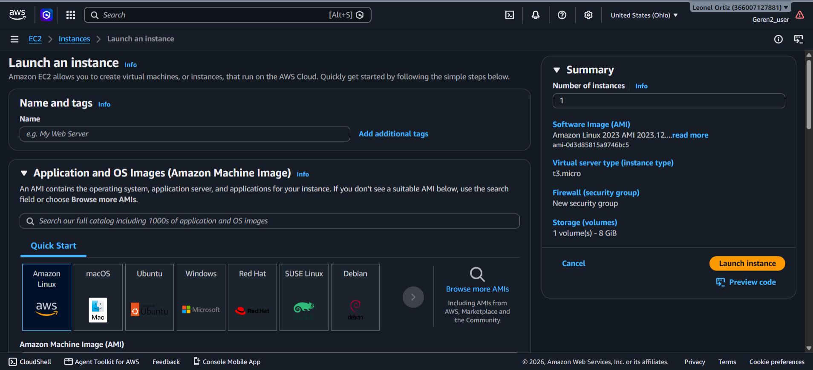
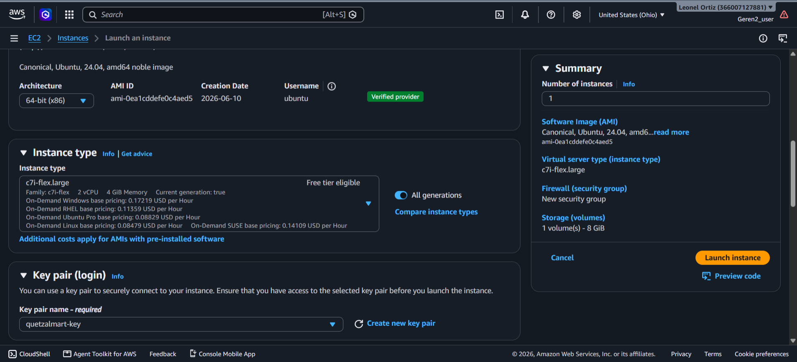
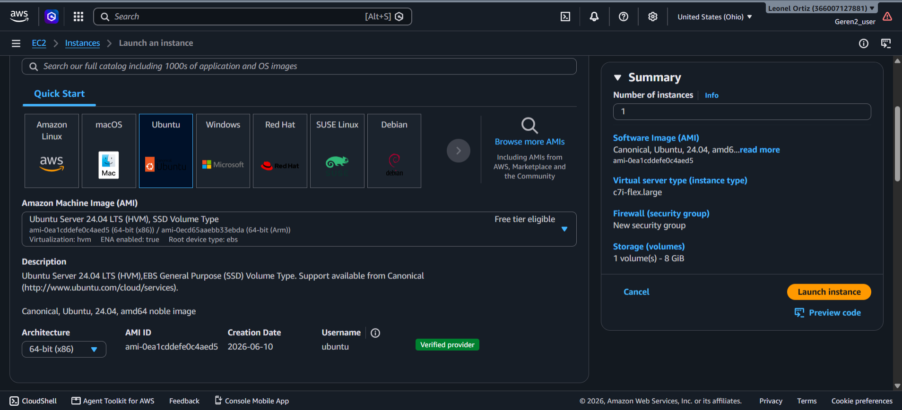
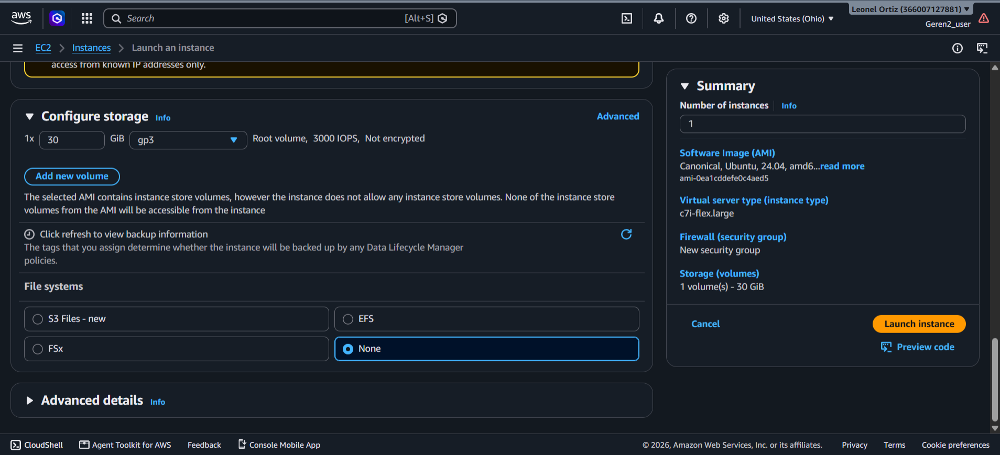
_Creación e inicialización de la base de datos empresarial `quetzalmart`._

---

### 1.2 Configuración de Seguridad y Red (Security Group)

Se configuró un grupo de seguridad dedicado (`quetzalmart-sg`) con las reglas de tráfico de entrada (_Inbound Rules_) necesarias para permitir la operación del ERP, la administración segura y la auditoría de base de datos durante la calificación:

| Protocolo            | Puerto | Origen (CIDR) | Finalidad                                                               |
| :------------------- | :----- | :------------ | :---------------------------------------------------------------------- |
| **SSH (TCP)**        | `22`   | `0.0.0.0/0`   | Acceso y gestión por terminal remota                                    |
| **Custom TCP**       | `8069` | `0.0.0.0/0`   | **Acceso a la plataforma web Odoo ERP**                                 |
| **PostgreSQL (TCP)** | `5432` | `0.0.0.0/0`   | **Acceso directo a la BD para DBeaver / Consultas SQL de calificación** |
| **HTTP (TCP)**       | `80`   | `0.0.0.0/0`   | Acceso web estándar / integración de portal                             |
| **HTTPS (TCP)**      | `443`  | `0.0.0.0/0`   | Tráfico seguro cifrado                                                  |

## 

_Configuración del grupo de seguridad para permitir el acceso a la plataforma web Odoo ERP, al servicio de base de datos PostgreSQL y a la administración segura por terminal remota._

### 1.3 Conexión Remota y Preparación del Servidor

El acceso seguro al servidor se realiza mediante Secure Shell (SSH) utilizando el par de llaves criptográficas RSA (`quetzalmart-key.pem`):

```bash
# Conexión SSH desde la terminal local al servidor AWS
ssh -i "quetzalmart-key.pem" ubuntu@3.140.234.169
```

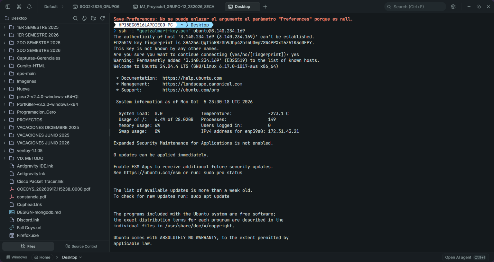

Una vez conectados al servidor, se procede con la actualización del índice de paquetes del sistema operativo:

```bash
sudo apt update && sudo apt upgrade -y
```


---

### 1.4 Instalación de Docker y Docker Compose

Se instaló el motor oficial de contenedores Docker y el plugin de orquestación Docker Compose v2:

```bash
# Instalación de Docker y Docker Compose
sudo apt install -y docker.io docker-compose-v2

# Habilitar e iniciar el servicio de Docker
sudo systemctl enable --now docker

# Agregar el usuario actual al grupo docker para ejecutar sin sudo
sudo usermod -aG docker ubuntu
newgrp docker
```

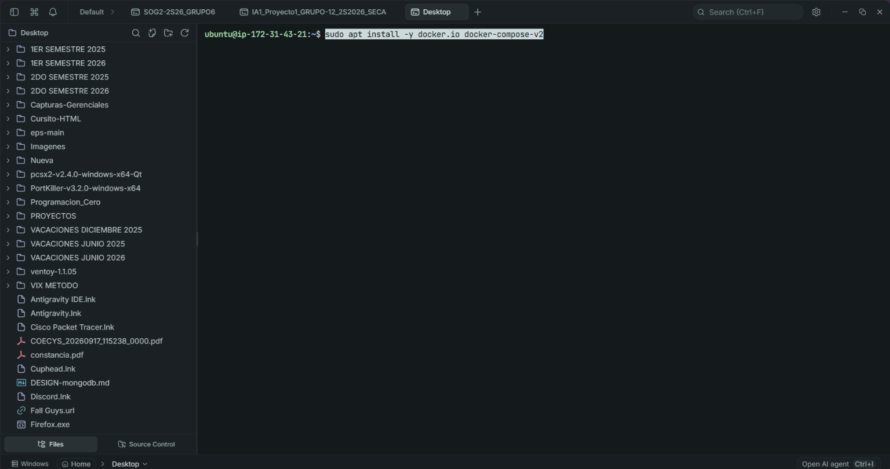


---

### 1.5 Configuración de Despliegue con Docker Compose

Se estructuró un directorio de trabajo aislado en `~/quetzalmart` para alojar los archivos de configuración, volúmenes de datos y el archivo de orquestación de servicios:

```bash
mkdir -p ~/quetzalmart/config ~/quetzalmart/extra-addons
cd ~/quetzalmart
```

#### Archivo `docker-compose.yml`:

Este archivo define los servicios interconectados `web` (Odoo) y `db` (PostgreSQL), configurando persistencia de datos y mapeo de puertos:

```yaml
services:
  web:
    image: odoo:17.0
    container_name: quetzalmart_odoo
    depends_on:
      - db
    ports:
      - "8069:8069"
    environment:
      - HOST=db
      - USER=odoo
      - PASSWORD=odoo_secure_pass_2026
    volumes:
      - odoo-web-data:/var/lib/odoo
      - ./config/odoo.conf:/etc/odoo/odoo.conf
      - ./extra-addons:/mnt/extra-addons
    restart: unless-stopped

  db:
    image: postgres:16-alpine
    container_name: quetzalmart_postgres
    environment:
      - POSTGRES_DB=postgres
      - POSTGRES_USER=odoo
      - POSTGRES_PASSWORD=odoo_secure_pass_2026
      - PGDATA=/var/lib/postgresql/data/pgdata
    ports:
      - "5432:5432"
    volumes:
      - odoo-db-data:/var/lib/postgresql/data/pgdata
    restart: unless-stopped

volumes:
  odoo-web-data:
  odoo-db-data:
```


#### Archivo `config/odoo.conf` (Optimización para Cargas Masivas):

Se configuraron límites de tiempo de CPU y de memoria ampliados para evitar caídas o timeouts durante la inyección de cientos de registros simultáneos:

```ini
[options]
addons_path = /usr/lib/python3/dist-packages/odoo/addons,/mnt/extra-addons
data_dir = /var/lib/odoo
admin_passwd = admin_master_quetzalmart_2026
db_host = db
db_port = 5432
db_user = odoo
db_password = odoo_secure_pass_2026
limit_memory_hard = 2684354560
limit_memory_soft = 2147483648
limit_request = 8192
limit_time_cpu = 600
limit_time_real = 1200
max_cron_threads = 2
proxy_mode = True
```

#### Despliegue de los Contenedores:

```bash
docker compose up -d
```

Se verifica el correcto arranque con:

```bash
docker compose ps
```


---

### 1.6 Creación e Inicialización de la Base de Datos en Odoo

Se ingresó a la interfaz web a través de la dirección IP pública: **`http://3.140.234.169:8069`**.

En el asistente de inicialización de Odoo se configuraron los siguientes parámetros:

- **Master Password:** `admin_master_quetzalmart_2026`
- **Database Name:** `quetzalmart`
- **Email (Administrador):** `admin@quetzalmart.gt`
- **Language:** Spanish (GT) / Español (Guatemala)
- **Country:** Guatemala
- **Demo Data:** _Desmarcado_ (para garantizar una base de datos limpia y sin registros basura).

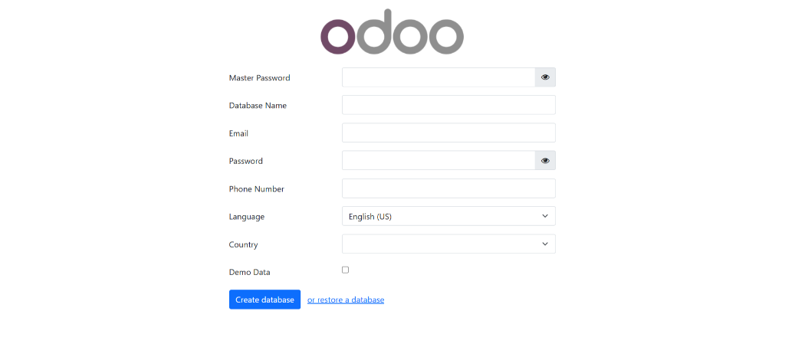
_Creación e inicialización de la base de datos empresarial `quetzalmart`._

---

### 1.7 Instalación de Módulos Base del ERP

Una vez creada la base de datos, se accedió al panel de Aplicaciones e instalaron los módulos oficiales requeridos para el supermercado QuetzalMart:

- **Ventas (Sales):** Gestión de presupuestos, cotizaciones, órdenes de venta y facturación asociada.
- **Compras (Purchase):** Gestión de proveedores, solicitudes de cotización, órdenes de compra y facturas de compras.
- **Inventario (Inventory):** Control de existencias, albaranes de entrada/salida y trazabilidad de productos.
- **Facturación (Invoicing):** Asientos contables y emisión/registro de facturas.

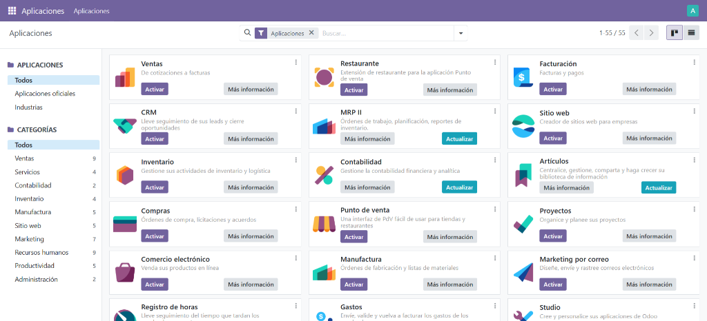
_Instalación de las aplicaciones del ERP en la nube._

---

## 2. Proceso de Carga Masiva y Operación

Para asegurar la integridad de la base de datos y evitar los problemas comunes de inconsistencias en llaves foráneas o asientos contables huérfanos, se desarrolló un script en Python (`cargar_odoo_masivo.py`) que interactúa de manera directa con la **API oficial XML-RPC** de Odoo.

### 2.1 Ejecución del Script de Carga Masiva

El script fue ejecutado conectándose al servidor de AWS con las credenciales de administración:

```bash
python cargar_odoo_masivo.py --url http://3.140.234.169:8069 --db quetzalmart --user admin@quetzalmart.gt --password Admin123*
```

**Resumen de la ejecución exitosa:**

- **Contactos:** 35 clientes y 20 proveedores registrados con direcciones, teléfonos, NIT/Tax ID y localización internacional (Guatemala, México, El Salvador).
- **Materiales de Sucursales:** 60 materiales de operación registrados bajo la codificación `MAT-001` a `MAT-060`.
- **Productos Comerciales:** 40 productos de supermercado categorizados con códigos de barra y costos.
- **Compras:** 100 órdenes de compra confirmadas con sus facturas asociadas.
- **Cotizaciones:** 20 cotizaciones (10 presupuestos de venta y 10 solicitudes de presupuesto de compra).
- **Ventas:** 150 órdenes de venta a diferentes clientes con diversos productos, confirmadas y facturadas.


---

### 2.2 Evidencia Operativa en los Módulos del ERP

#### Módulo de Compras (100 Compras + 10 Cotizaciones = 110 Registros)

Se observa en la vista del ERP las solicitudes de cotización (`P00105`, `P00106`, etc.) y las órdenes de compra confirmadas hacia los diferentes proveedores:

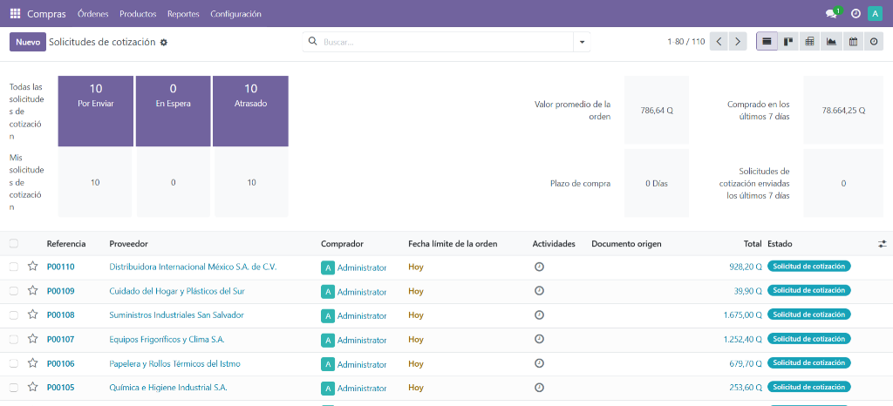
_Lista de órdenes de compra y cotizaciones a proveedores en Odoo._

---

#### Módulo de Contactos (Clientes y Proveedores Internacionales)

Se constata el registro de clientes y empresas proveedoras para las sucursales de Guatemala, México (ej. _Comercial de Insumos CDMX_, _Corporación Gastronómica Azteca_) y El Salvador (ej. _Alimentos Cuscatlán_, _Comercializadora San Salvador_):

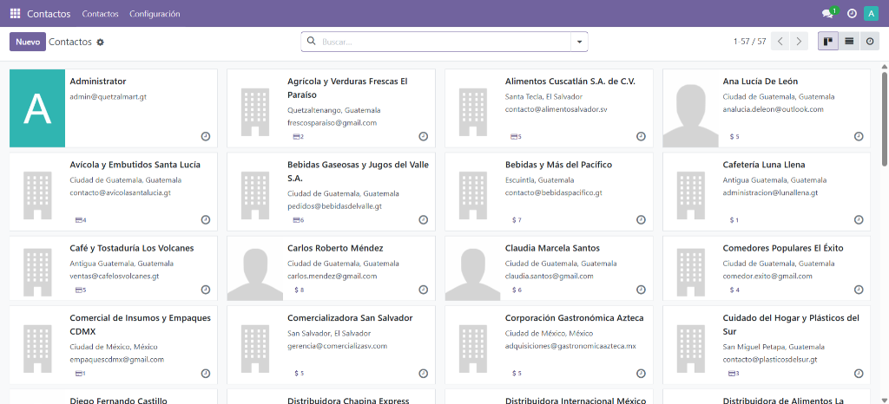
_Catálogo consolidado de clientes y proveedores de QuetzalMart._

---

#### Módulo de Ventas (150 Ventas Confirmadas + 10 Presupuestos = 160 Registros)

Se aprecian las 150 órdenes de venta en estado verde `Orden de venta` generadas hacia clientes variados, junto con los 10 presupuestos de cotización:

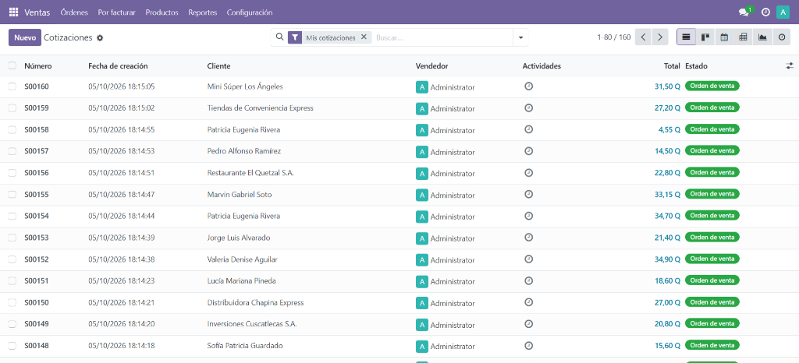
_Vista de órdenes de venta confirmadas y cotizaciones en Odoo._

---

#### Trazabilidad de Almacén e Inventario

Como resultado directo de las compras y ventas procesadas, el módulo de inventario generó automáticamente **100 recepciones en almacén** y **150 órdenes de entrega/despacho**, demostrando el flujo logístico integral:

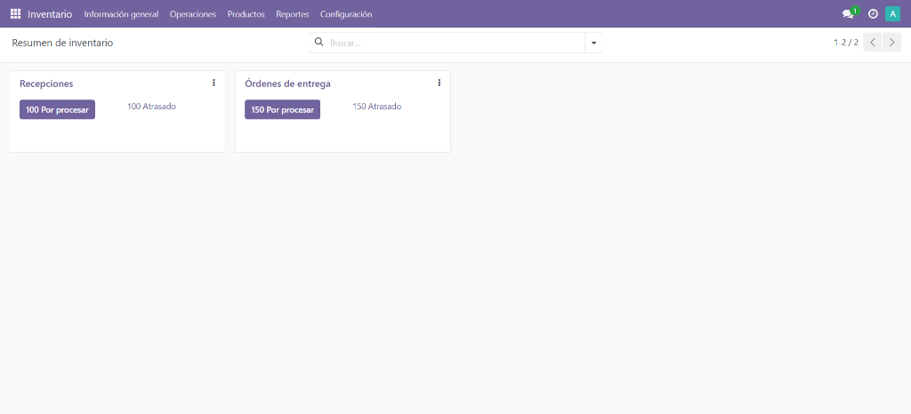
_Trazabilidad de albaranes de entrada y órdenes de despacho en el almacén._

---

## 3. Comprobación y Auditoría por Consultas a la Base de Datos (PostgreSQL)

Tal como exige el enunciado del proyecto (_"estos deben de poder comprobarse mediante consulta de base de datos"_), se habilitó el puerto `5432` en el contenedor PostgreSQL de AWS para permitir la verificación mediante clientes SQL (DBeaver, pgAdmin) o directamente mediante la terminal `psql`.

### 3.1 Consulta de Auditoría Consolidada (Resumen General)

```sql
SELECT
    (SELECT COUNT(*) FROM sale_order WHERE state IN ('sale', 'done')) AS ventas_confirmadas,
    (SELECT COUNT(*) FROM purchase_order WHERE state IN ('purchase', 'done')) AS compras_confirmadas,
    ((SELECT COUNT(*) FROM sale_order WHERE state IN ('draft', 'sent')) +
     (SELECT COUNT(*) FROM purchase_order WHERE state IN ('draft', 'sent'))) AS cotizaciones_totales,
    (SELECT COUNT(*) FROM product_product pp JOIN product_template pt ON pt.id = pp.product_tmpl_id WHERE pp.default_code LIKE 'MAT-%') AS materiales_sucursales,
    (SELECT COUNT(*) FROM res_partner WHERE customer_rank > 0) AS clientes_totales,
    (SELECT COUNT(*) FROM res_partner WHERE supplier_rank > 0) AS proveedores_totales;
```

**Resultado de la Consulta:**

| ventas_confirmadas | compras_confirmadas | cotizaciones_totales | materiales_sucursales | clientes_totales | proveedores_totales |
| :----------------: | :-----------------: | :------------------: | :-------------------: | :--------------: | :-----------------: |
|      **150**       |       **100**       |        **20**        |        **60**         |      **35**      |       **20**        |

---

### 3.2 Consultas Específicas por Requerimiento

#### 1. Verificación de 150 Ventas y Variedad de Clientes y Productos:

```sql
-- Total de ventas confirmadas:
SELECT COUNT(*) FROM sale_order WHERE state IN ('sale', 'done');
-- Resultado: 150

-- Variedad de clientes en las ventas:
SELECT COUNT(DISTINCT partner_id) FROM sale_order WHERE state IN ('sale', 'done');
-- Resultado: 35 clientes distintos

-- Variedad de productos vendidos:
SELECT COUNT(DISTINCT sol.product_id)
FROM sale_order_line sol
JOIN sale_order so ON so.id = sol.order_id
WHERE so.state IN ('sale', 'done');
-- Resultado: 40 productos distintos
```

#### 2. Verificación de las 20 Cotizaciones:

```sql
-- Cotizaciones a clientes:
SELECT COUNT(*) FROM sale_order WHERE state IN ('draft', 'sent');
-- Resultado: 10

-- Cotizaciones a proveedores:
SELECT COUNT(*) FROM purchase_order WHERE state IN ('draft', 'sent');
-- Resultado: 10

-- Total combinado:
-- Resultado: 20 cotizaciones
```

#### 3. Verificación de 100 Compras y Facturas Asociadas:

```sql
-- Total de compras confirmadas:
SELECT COUNT(*) FROM purchase_order WHERE state IN ('purchase', 'done');
-- Resultado: 100

-- Total de facturas de proveedor en contabilidad:
SELECT COUNT(*) FROM account_move WHERE move_type = 'in_invoice';
-- Resultado: 100
```

#### 4. Verificación de los 60 Materiales de Operación de Sucursales:

```sql
-- Conteo de materiales con prefijo MAT-:
SELECT COUNT(*)
FROM product_product pp
JOIN product_template pt ON pt.id = pp.product_tmpl_id
WHERE pp.default_code LIKE 'MAT-%';
-- Resultado: 60

-- Listado de materiales para auditoría:
SELECT
    pp.default_code AS codigo_material,
    pt.name AS nombre_material,
    pt.detailed_type AS tipo,
    pt.list_price AS precio
FROM product_product pp
JOIN product_template pt ON pt.id = pp.product_tmpl_id
WHERE pp.default_code LIKE 'MAT-%'
ORDER BY pp.default_code ASC;
```
