# Manual 1: Guía Técnica de Instalación, Configuración y Carga Masiva del Sistema ERP

## Proyecto QuetzalMart - Sistemas Operativos 2

---

## 1. Primera Sección: Manual Detallado de Instalación del Sistema en la Nube

### 1.1 Arquitectura de la Solución e Infraestructura Cloud

Para cumplir con los requerimientos de alta disponibilidad, concurrencia y escalabilidad de la cadena de supermercados **QuetzalMart**, se implementó la solución utilizando una infraestructura en la nube de **Amazon Web Services (AWS)** con arquitectura de contenedores **Docker**:

- **Proveedor Cloud:** Amazon Web Services (AWS).
- **Región:** `us-east-2` (Ohio).
- **Servicio de Cómputo:** Amazon Elastic Compute Cloud (EC2).
- **Tipo de Instancia:** `c7i-flex.large` (2 vCPUs de última generación, 4.0 GiB de memoria RAM).
- **Almacenamiento:** 30 GiB en disco de estado sólido (EBS tipo `gp3`).
- **Sistema Operativo:** Ubuntu Server 24.04 LTS (x86_64).
- **Motor ERP:** Odoo Community Version 17.0.
- **Base de Datos Relacional:** PostgreSQL 16 (desplegado en contenedor persistente con exposición directa para auditoría y calificación).


_Creación e inicialización de la base de datos empresarial `quetzalmart`._

---

### 1.2 Configuración de Seguridad y Red (Security Group)

Se configuró un grupo de seguridad dedicado (`quetzalmart-sg`) con las reglas de tráfico de entrada (_Inbound Rules_) necesarias para permitir la operación del ERP, la administración segura y la auditoría de base de datos durante la calificación:

| Protocolo            | Puerto | Origen (CIDR) | Finalidad                                                               |
| :------------------- | :----- | :------------ | :---------------------------------------------------------------------- |
| **SSH (TCP)**        | `22`   | `0.0.0.0/0`   | Acceso y gestión por terminal remota                                    |
| **Custom TCP**       | `8069` | `0.0.0.0/0`   | **Acceso a la plataforma web Odoo ERP**                                 |
| **PostgreSQL (TCP)** | `5432` | `0.0.0.0/0`   | **Acceso directo a la BD para DBeaver / Consultas SQL de calificación** |
| **HTTP (TCP)**       | `80`   | `0.0.0.0/0`   | Acceso web estándar / integración de portal                             |
| **HTTPS (TCP)**      | `443`  | `0.0.0.0/0`   | Tráfico seguro cifrado                                                  |

## 

_Configuración del grupo de seguridad para permitir el acceso a la plataforma web Odoo ERP, al servicio de base de datos PostgreSQL y a la administración segura por terminal remota._

### 1.3 Conexión Remota y Preparación del Servidor

El acceso seguro al servidor se realiza mediante Secure Shell (SSH) utilizando el par de llaves criptográficas RSA (`quetzalmart-key.pem`):

```bash
# Conexión SSH desde la terminal local al servidor AWS
ssh -i "quetzalmart-key.pem" ubuntu@3.140.234.169
```


Una vez conectados al servidor, se procede con la actualización del índice de paquetes del sistema operativo:

```bash
sudo apt update && sudo apt upgrade -y
```


---

### 1.4 Instalación de Docker y Docker Compose

Se instaló el motor oficial de contenedores Docker y el plugin de orquestación Docker Compose v2:

```bash
# Instalación de Docker y Docker Compose
sudo apt install -y docker.io docker-compose-v2

# Habilitar e iniciar el servicio de Docker
sudo systemctl enable --now docker

# Agregar el usuario actual al grupo docker para ejecutar sin sudo
sudo usermod -aG docker ubuntu
newgrp docker
```


---

### 1.5 Configuración de Despliegue con Docker Compose

Se estructuró un directorio de trabajo aislado en `~/quetzalmart` para alojar los archivos de configuración, volúmenes de datos y el archivo de orquestación de servicios:

```bash
mkdir -p ~/quetzalmart/config ~/quetzalmart/extra-addons
cd ~/quetzalmart
```

#### Archivo `docker-compose.yml`:

Este archivo define los servicios interconectados `web` (Odoo) y `db` (PostgreSQL), configurando persistencia de datos y mapeo de puertos:

```yaml
services:
  web:
    image: odoo:17.0
    container_name: quetzalmart_odoo
    depends_on:
      - db
    ports:
      - "8069:8069"
    environment:
      - HOST=db
      - USER=odoo
      - PASSWORD=odoo_secure_pass_2026
    volumes:
      - odoo-web-data:/var/lib/odoo
      - ./config/odoo.conf:/etc/odoo/odoo.conf
      - ./extra-addons:/mnt/extra-addons
    restart: unless-stopped

  db:
    image: postgres:16-alpine
    container_name: quetzalmart_postgres
    environment:
      - POSTGRES_DB=postgres
      - POSTGRES_USER=odoo
      - POSTGRES_PASSWORD=odoo_secure_pass_2026
      - PGDATA=/var/lib/postgresql/data/pgdata
    ports:
      - "5432:5432"
    volumes:
      - odoo-db-data:/var/lib/postgresql/data/pgdata
    restart: unless-stopped

volumes:
  odoo-web-data:
  odoo-db-data:
```


#### Archivo `config/odoo.conf` (Optimización para Cargas Masivas):

Se configuraron límites de tiempo de CPU y de memoria ampliados para evitar caídas o timeouts durante la inyección de cientos de registros simultáneos:

```ini
[options]
addons_path = /usr/lib/python3/dist-packages/odoo/addons,/mnt/extra-addons
data_dir = /var/lib/odoo
admin_passwd = admin_master_quetzalmart_2026
db_host = db
db_port = 5432
db_user = odoo
db_password = odoo_secure_pass_2026
limit_memory_hard = 2684354560
limit_memory_soft = 2147483648
limit_request = 8192
limit_time_cpu = 600
limit_time_real = 1200
max_cron_threads = 2
proxy_mode = True
```

#### Despliegue de los Contenedores:

```bash
docker compose up -d
```

Se verifica el correcto arranque con:

```bash
docker compose ps
```


---

### 1.6 Creación e Inicialización de la Base de Datos en Odoo

Se ingresó a la interfaz web a través de la dirección IP pública: **`http://3.140.234.169:8069`**.

En el asistente de inicialización de Odoo se configuraron los siguientes parámetros:

- **Master Password:** `admin_master_quetzalmart_2026`
- **Database Name:** `quetzalmart`
- **Email (Administrador):** `admin@quetzalmart.gt`
- **Language:** Spanish (GT) / Español (Guatemala)
- **Country:** Guatemala
- **Demo Data:** _Desmarcado_ (para garantizar una base de datos limpia y sin registros basura).


_Creación e inicialización de la base de datos empresarial `quetzalmart`._

---

### 1.7 Instalación de Módulos Base del ERP

Una vez creada la base de datos, se accedió al panel de Aplicaciones e instalaron los módulos oficiales requeridos para el supermercado QuetzalMart:

- **Ventas (Sales):** Gestión de presupuestos, cotizaciones, órdenes de venta y facturación asociada.
- **Compras (Purchase):** Gestión de proveedores, solicitudes de cotización, órdenes de compra y facturas de compras.
- **Inventario (Inventory):** Control de existencias, albaranes de entrada/salida y trazabilidad de productos.
- **Facturación (Invoicing):** Asientos contables y emisión/registro de facturas.


_Instalación de las aplicaciones del ERP en la nube._

---

## 2. Proceso de Carga Masiva y Operación

Para asegurar la integridad de la base de datos y evitar los problemas comunes de inconsistencias en llaves foráneas o asientos contables huérfanos, se desarrolló un script en Python (`cargar_odoo_masivo.py`) que interactúa de manera directa con la **API oficial XML-RPC** de Odoo.

### 2.1 Ejecución del Script de Carga Masiva

El script fue ejecutado conectándose al servidor de AWS con las credenciales de administración:

```bash
python cargar_odoo_masivo.py --url http://3.140.234.169:8069 --db quetzalmart --user admin@quetzalmart.gt --password Admin123*
```

**Resumen de la ejecución exitosa:**

- **Contactos:** 35 clientes y 20 proveedores registrados con direcciones, teléfonos, NIT/Tax ID y localización internacional (Guatemala, México, El Salvador).
- **Materiales de Sucursales:** 60 materiales de operación registrados bajo la codificación `MAT-001` a `MAT-060`.
- **Productos Comerciales:** 40 productos de supermercado categorizados con códigos de barra y costos.
- **Compras:** 100 órdenes de compra confirmadas con sus facturas asociadas.
- **Cotizaciones:** 20 cotizaciones (10 presupuestos de venta y 10 solicitudes de presupuesto de compra).
- **Ventas:** 150 órdenes de venta a diferentes clientes con diversos productos, confirmadas y facturadas.


---

### 2.2 Evidencia Operativa en los Módulos del ERP

#### Módulo de Compras (100 Compras + 10 Cotizaciones = 110 Registros)

Se observa en la vista del ERP las solicitudes de cotización (`P00105`, `P00106`, etc.) y las órdenes de compra confirmadas hacia los diferentes proveedores:


_Lista de órdenes de compra y cotizaciones a proveedores en Odoo._

---

#### Módulo de Contactos (Clientes y Proveedores Internacionales)

Se constata el registro de clientes y empresas proveedoras para las sucursales de Guatemala, México (ej. _Comercial de Insumos CDMX_, _Corporación Gastronómica Azteca_) y El Salvador (ej. _Alimentos Cuscatlán_, _Comercializadora San Salvador_):


_Catálogo consolidado de clientes y proveedores de QuetzalMart._

---

#### Módulo de Ventas (150 Ventas Confirmadas + 10 Presupuestos = 160 Registros)

Se aprecian las 150 órdenes de venta en estado verde `Orden de venta` generadas hacia clientes variados, junto con los 10 presupuestos de cotización:


_Vista de órdenes de venta confirmadas y cotizaciones en Odoo._

---

#### Trazabilidad de Almacén e Inventario

Como resultado directo de las compras y ventas procesadas, el módulo de inventario generó automáticamente **100 recepciones en almacén** y **150 órdenes de entrega/despacho**, demostrando el flujo logístico integral:


_Trazabilidad de albaranes de entrada y órdenes de despacho en el almacén._

---

## 3. Comprobación y Auditoría por Consultas a la Base de Datos (PostgreSQL)

Tal como exige el enunciado del proyecto (_"estos deben de poder comprobarse mediante consulta de base de datos"_), se habilitó el puerto `5432` en el contenedor PostgreSQL de AWS para permitir la verificación mediante clientes SQL (DBeaver, pgAdmin) o directamente mediante la terminal `psql`.

### 3.1 Consulta de Auditoría Consolidada (Resumen General)

```sql
SELECT
    (SELECT COUNT(*) FROM sale_order WHERE state IN ('sale', 'done')) AS ventas_confirmadas,
    (SELECT COUNT(*) FROM purchase_order WHERE state IN ('purchase', 'done')) AS compras_confirmadas,
    ((SELECT COUNT(*) FROM sale_order WHERE state IN ('draft', 'sent')) +
     (SELECT COUNT(*) FROM purchase_order WHERE state IN ('draft', 'sent'))) AS cotizaciones_totales,
    (SELECT COUNT(*) FROM product_product pp JOIN product_template pt ON pt.id = pp.product_tmpl_id WHERE pp.default_code LIKE 'MAT-%') AS materiales_sucursales,
    (SELECT COUNT(*) FROM res_partner WHERE customer_rank > 0) AS clientes_totales,
    (SELECT COUNT(*) FROM res_partner WHERE supplier_rank > 0) AS proveedores_totales;
```

**Resultado de la Consulta:**

| ventas_confirmadas | compras_confirmadas | cotizaciones_totales | materiales_sucursales | clientes_totales | proveedores_totales |
| :----------------: | :-----------------: | :------------------: | :-------------------: | :--------------: | :-----------------: |
|      **150**       |       **100**       |        **20**        |        **60**         |      **35**      |       **20**        |

---

### 3.2 Consultas Específicas por Requerimiento

#### 1. Verificación de 150 Ventas y Variedad de Clientes y Productos:

```sql
-- Total de ventas confirmadas:
SELECT COUNT(*) FROM sale_order WHERE state IN ('sale', 'done');
-- Resultado: 150

-- Variedad de clientes en las ventas:
SELECT COUNT(DISTINCT partner_id) FROM sale_order WHERE state IN ('sale', 'done');
-- Resultado: 35 clientes distintos

-- Variedad de productos vendidos:
SELECT COUNT(DISTINCT sol.product_id)
FROM sale_order_line sol
JOIN sale_order so ON so.id = sol.order_id
WHERE so.state IN ('sale', 'done');
-- Resultado: 40 productos distintos
```

#### 2. Verificación de las 20 Cotizaciones:

```sql
-- Cotizaciones a clientes:
SELECT COUNT(*) FROM sale_order WHERE state IN ('draft', 'sent');
-- Resultado: 10

-- Cotizaciones a proveedores:
SELECT COUNT(*) FROM purchase_order WHERE state IN ('draft', 'sent');
-- Resultado: 10

-- Total combinado:
-- Resultado: 20 cotizaciones
```

#### 3. Verificación de 100 Compras y Facturas Asociadas:

```sql
-- Total de compras confirmadas:
SELECT COUNT(*) FROM purchase_order WHERE state IN ('purchase', 'done');
-- Resultado: 100

-- Total de facturas de proveedor en contabilidad:
SELECT COUNT(*) FROM account_move WHERE move_type = 'in_invoice';
-- Resultado: 100
```

#### 4. Verificación de los 60 Materiales de Operación de Sucursales:

```sql
-- Conteo de materiales con prefijo MAT-:
SELECT COUNT(*)
FROM product_product pp
JOIN product_template pt ON pt.id = pp.product_tmpl_id
WHERE pp.default_code LIKE 'MAT-%';
-- Resultado: 60

-- Listado de materiales para auditoría:
SELECT
    pp.default_code AS codigo_material,
    pt.name AS nombre_material,
    pt.detailed_type AS tipo,
    pt.list_price AS precio
FROM product_product pp
JOIN product_template pt ON pt.id = pp.product_tmpl_id
WHERE pp.default_code LIKE 'MAT-%'
ORDER BY pp.default_code ASC;
```

## 5. Módulos instalados para la tienda, el CRM y el marketing

Sobre el ERP Odoo 17 ya desplegado en AWS se instalaron los módulos siguientes, mediante el script `01_instalar_modulos.py` (que usa la API XML-RPC de Odoo):

| Módulo | Para qué sirve |
| :--- | :--- |
| `website`, `website_sale` | Sitio web y tienda en línea: catálogo, carrito y proceso de compra |
| `delivery`, `website_sale_delivery` | Métodos y costo de envío dentro del carrito |
| `payment_demo`, `payment_custom` | Integración de pago (pasarela de demostración y transferencia bancaria) |
| `crm`, `website_crm` | Gestión de clientes y oportunidades; el formulario de contacto del sitio genera leads |
| `mass_mailing`, `website_mass_mailing` | Correo de marketing y suscripción desde la web |
| `base_automation` | Regla automática que envía la campaña después de una compra |

---

## 6. Tienda en línea

### 6.1 Configuración y publicación del catálogo

Con `02_configurar_tienda.py` se publicaron los 40 productos del catálogo, agrupados en 9 categorías (Alimentos, Lácteos, Bebidas, Carnes, Panadería, Snacks, Cuidado Personal, Limpieza y Hogar). Cada producto tiene imagen, descripción y precio con IVA incluido. También se creó el impuesto **IVA 12%** y el método de envío **Envío estándar QuetzalMart** (tarifa fija de 2.50, gratis en compras mayores a 25).

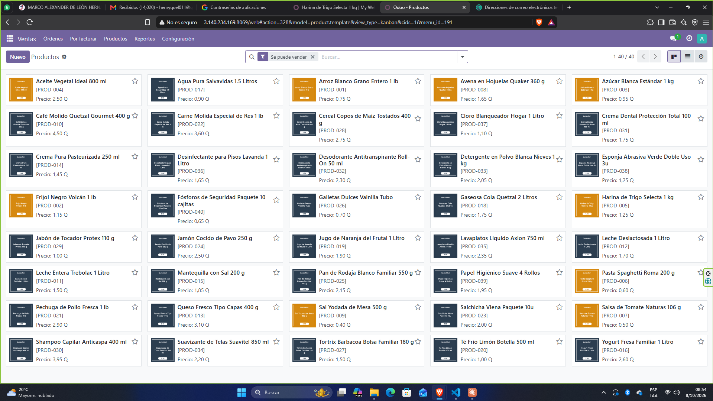
_Productos del catálogo en el ERP._

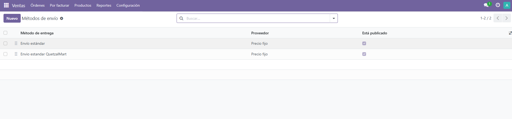
_Método de envío configurado._

### 6.2 Portada y catálogo para el cliente

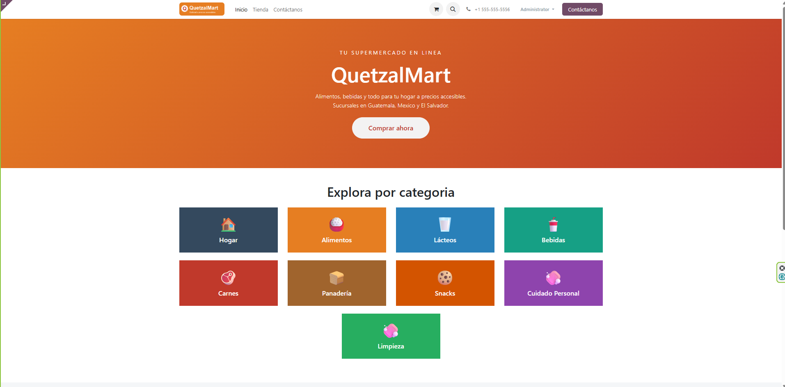
_Portada de QuetzalMart con logo y categorías._

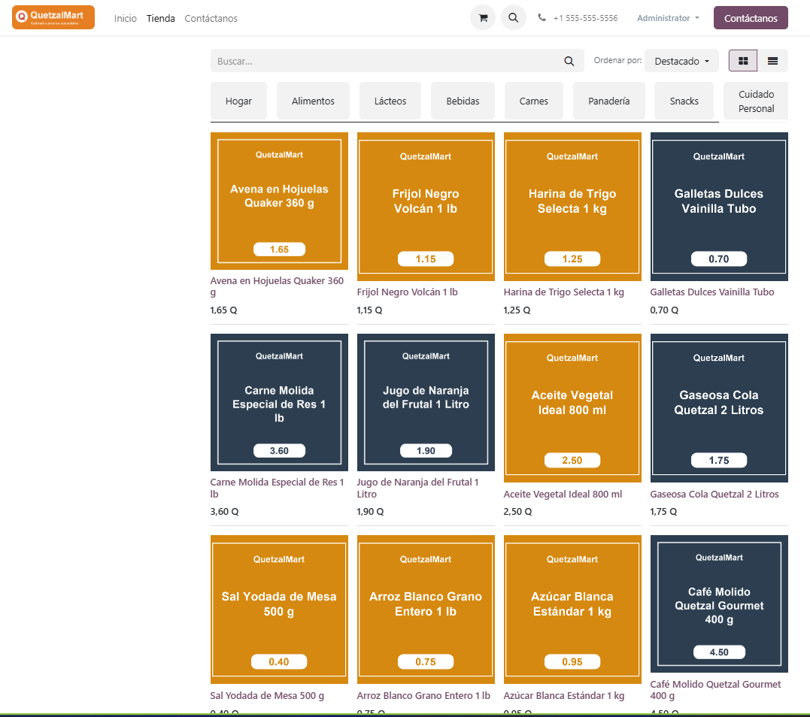
_Catálogo con imágenes, nombre y precio de cada producto._

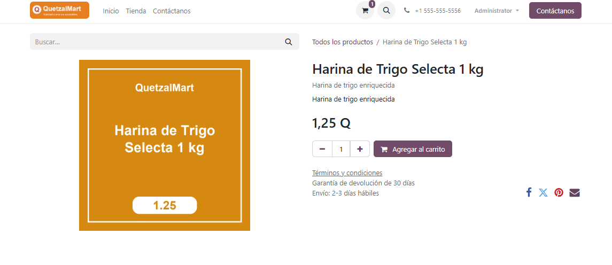
_Detalle de un producto._

### 6.3 Carrito de compras, impuestos y envío

El cliente puede agregar y eliminar productos. El carrito calcula el IVA (12%) y el costo de envío.

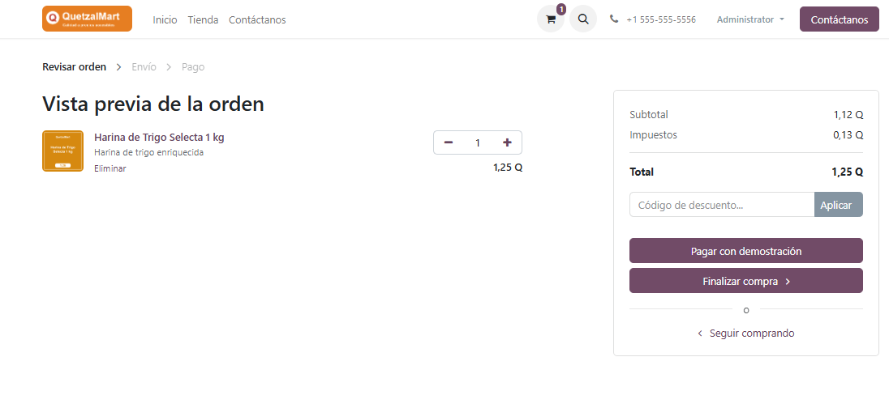
_Carrito de compras._

### 6.4 Proceso de pago

Se activaron dos proveedores de pago: **Demo** (pasarela de demostración que simula el cobro con tarjeta) y **Transferencia bancaria**.

### 6.5 Pedidos y facturas generadas automáticamente

Al completar el pago, Odoo confirma el pedido de venta, genera la factura, la publica y registra el pago de forma automática (opción *Facturación automática* de Ventas).

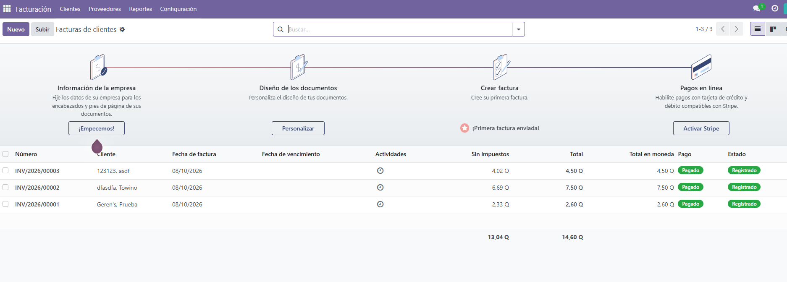
_Listado de facturas._

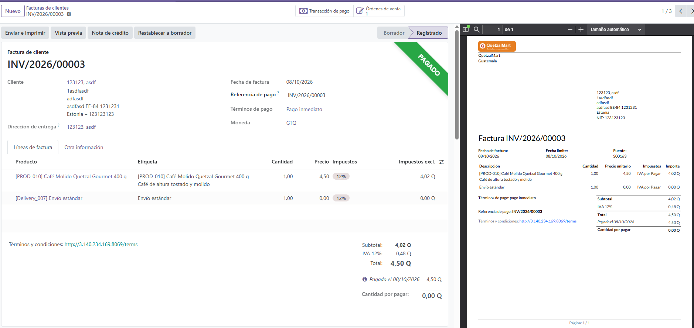
_Factura publicada y pagada, con su PDF._

---

## 7. Correo electrónico

### 7.1 Servidor de correo saliente

Odoo envía los correos por SMTP (`smtp.gmail.com`, puerto 587, cifrado STARTTLS) mediante el servidor saliente **QuetzalMart SMTP**, configurado con `03_configurar_correo.py`. Allí también se fijó la dirección pública del sitio (`web.base.url`) para que los enlaces de los correos funcionen, y se acortó el intervalo de la cola de correo a un minuto.

### 7.2 Correos de la compra

Tras una compra el cliente recibe, en este orden:
1. **Confirmación del pedido** (`QuetzalMart Orden (Ref S0xxxx)`) con el pedido en PDF adjunto.
2. **Factura** (`QuetzalMart Factura (Ref INV/...)`) con la factura en PDF adjunta.
3. **Campaña de marketing** (`QuetzalMart: gracias por tu compra, tienes 10% de descuento`).

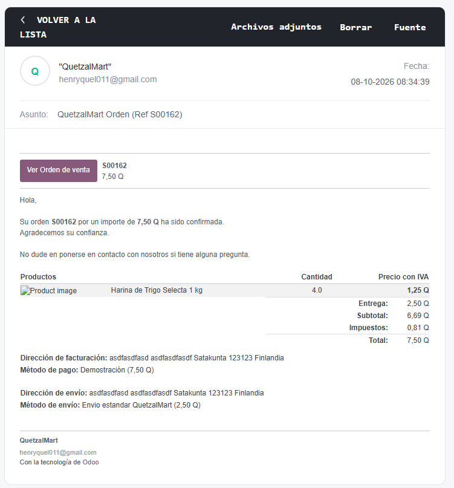
_Correo de confirmación recibido en una bandeja temporal._

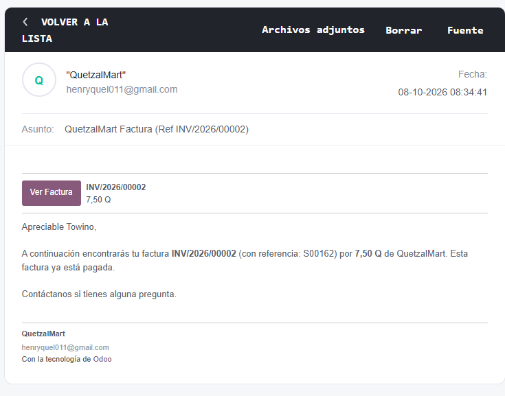
_Correo con la factura adjunta._

### 7.3 Campaña de marketing automática

Se creó la plantilla HTML **QuetzalMart - Campaña de Marketing** (degradado naranja, cupón de descuento, botón a la tienda y tarjetas de categorías). Una regla automática la envía cuando la factura de una compra web queda pagada: se encola y sale aproximadamente un minuto después, para que llegue después del correo de la compra. Los dos tipos de correo tienen asuntos distintos y salen del servidor de la tienda, no de un buzón personal de un integrante.

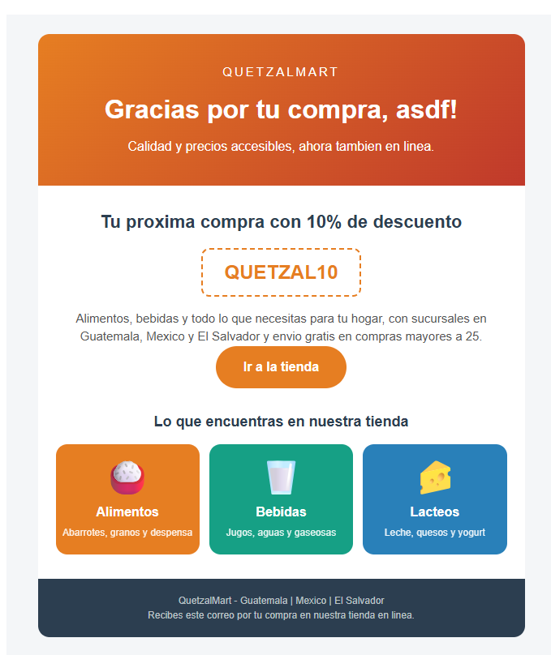
_Campaña de marketing recibida._

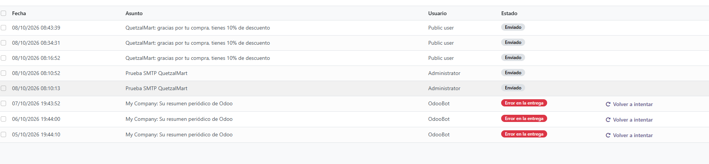
_Registro de correos enviados por Odoo._

---

## 8. CRM: manejo de clientes

Se cargaron los clientes del ERP y 12 oportunidades de ejemplo (pedidos mayoristas, contratos de suministro, cotizaciones) con el script `06_cargar_crm.py`, repartidas en las etapas del embudo de ventas. Los visitantes que llenan el formulario de contacto del sitio generan un lead automáticamente.

---

## 9. Procedimiento de reproducción

Desde `Proyecto/Integrante2-Tienda-CRM-Marketing/`, con el archivo `.env` completo (se parte de `.env.example`):

```bash
pip install pillow
python 00_diagnostico.py          # estado inicial (solo lectura)
python 01_instalar_modulos.py     # módulos
python 02_configurar_tienda.py    # catálogo, IVA, envío, pagos
python 03_configurar_correo.py    # SMTP, campaña, regla automática
python 04_probar_correo.py --to alguien@temp-mail.org
python 06_cargar_crm.py           # oportunidades de ejemplo
python 08_logo_y_portada.py       # logo y portada
```

---

### Capturas que se toman a mano (temp-mail)
Hacer una compra en `http://3.140.234.169:8069/shop` con una dirección de temp-mail.org y guardar en `Manual1/imagenes/integrante2/`:
- `30-correo-confirmacion.png`: correo de la orden
- `31-correo-factura.png`: correo de la factura (con el clip de adjunto visible)
- `32-correo-marketing.png`: correo de la campaña


## 10. Automatización del Proceso de Carga con RPA (UiPath)

### 10.1 Problema de Negocio a Resolver

El departamento de ventas de QuetzalMart organizó históricamente su información en una jerarquía de carpetas poco práctica (`clientes`, `proveedores`, `reclamos`, `registro`, `productos`), con nombres de archivo que contienen guiones y descripciones adicionales. Dentro de cada archivo Excel existen **varias hojas con información adicional**, pero únicamente las hojas llamadas **`clientes`** y **`productos`** son relevantes para la carga al ERP.

| Problema detectado | Solución implementada con RPA |
| :--- | :--- |
| Dispersión de archivos en una jerarquía de carpetas profunda | Escaneo recursivo automático de toda la estructura (`AllDirectories`) |
| Archivos con hojas irrelevantes (reclamos, registros, proveedores) | Detección de las hojas `clientes` y `productos` antes de leer; el resto se omite y se registra |
| Horas de digitación manual y errores humanos de transcripción | Lectura programática de cada hoja a un DataTable y envío a la API del ERP |
| Riesgo de duplicar registros si el proceso se repite | Verificación previa de existencia antes de crear cada registro |
| Datos sucios (filas sin nombre, precios no numéricos, encabezados con `*`) | Validaciones por fila: se rechazan o se omiten y quedan en el LOG con el motivo |
| Falta de trazabilidad de lo que se cargó | Archivo LOG por fila (creado, omitido, error) y resumen final en pantalla |

---

### 10.2 Preparación del Entorno RPA

**Herramienta:** UiPath Studio Community Edition (licencia gratuita).

1. Descarga e instalación de UiPath Studio. En el instalador solo se seleccionó el componente **Studio**.

   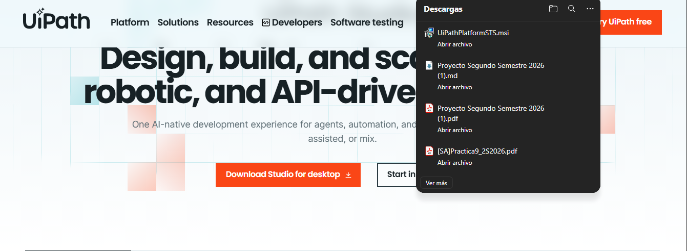
   _Instalación de UiPath Studio Community Edition._

2. Inicio de sesión en UiPath Cloud (`https://cloud.uipath.com`) con la cuenta Community.

3. Creación del proyecto **`QuetzalMart_RPA`** (tipo *Proceso*, lenguaje de expresiones VB.NET).

   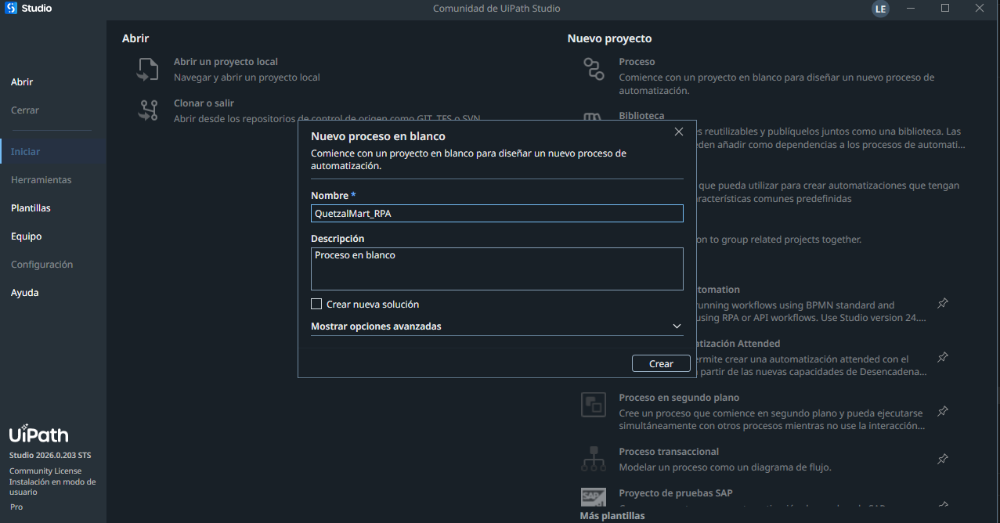
   _Creación del proyecto de automatización en UiPath Studio._

4. Instalación de los paquetes necesarios desde **Administrar paquetes**:

   | Paquete | Función en el bot |
   | :--- | :--- |
   | `UiPath.Excel.Activities` | **Utilice el archivo de Excel** y **Leer rango** para leer las hojas `clientes` y `productos` |
   | `UiPath.System.Activities` | `Para cada`, `Asignar`, `Try Catch`, `Invocar flujo de trabajo`, `Invocar código` |
   | `UiPath.Web.Activities` | **Solicitud HTTP** (`NetHttpRequest`) para consumir la API XML-RPC de Odoo |

   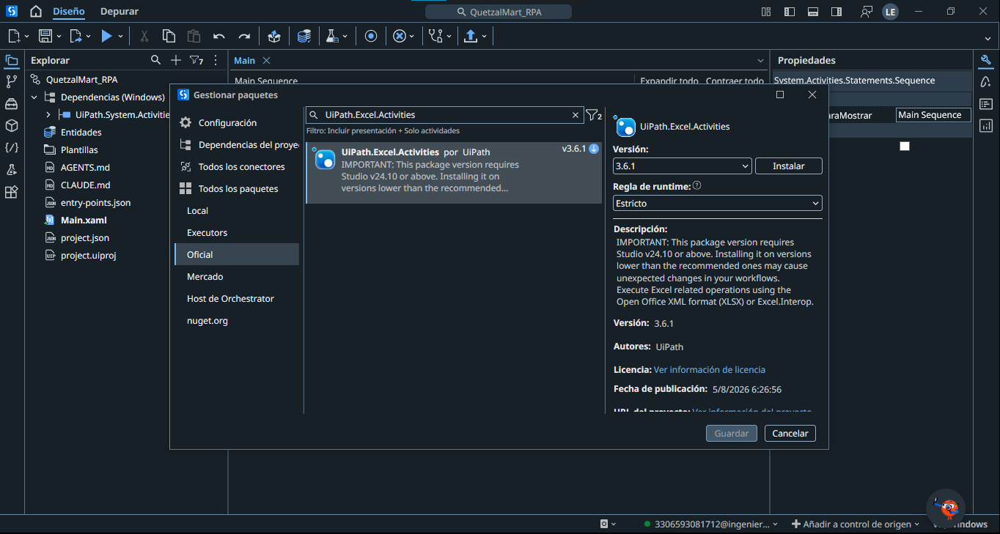
   _Gestor de paquetes con las actividades instaladas._

---

### 10.3 Arquitectura del Bot

El proyecto se organiza en flujos de trabajo modulares y reutilizables:

| Flujo de trabajo | Responsabilidad |
| :--- | :--- |
| `Main.xaml` | Orquestador: escanea carpetas, detecta hojas, hace login, coordina los sub-flujos y escribe el LOG |
| `OdooLogin.xaml` | Autentica contra Odoo (`authenticate`) y devuelve el `uid` |
| `POST_Xml.xaml` | Envía el XML-RPC con una **Solicitud HTTP** (`POST`, `text/xml`) y devuelve el texto de la respuesta |
| `OdooExec.xaml` | Ejecuta cualquier método de Odoo (`execute_kw`) y lanza una excepción si la respuesta contiene un `fault` |
| `OdooSearch.xaml` | Busca un registro por un campo (`search`); se usa para duplicados y llaves foráneas |
| `ProcesarClientes.xaml` | Lee la hoja `clientes`, arma el payload y crea los registros en `res.partner` |
| `ProcesarProductos.xaml` | Lee la hoja `productos`, valida números, crea plantilla, variante e inventario |

**Parámetros del proyecto** (argumentos de `Main`, para no dejar credenciales fijas dentro de los flujos):

| Parámetro | Valor |
| :--- | :--- |
| `in_url` | `http://<IP_DEL_SERVIDOR>:8069` |
| `in_db` | *(nombre de la base de datos)* |
| `in_usuario` | *(usuario de Odoo)* |
| `in_password` | *(contraseña, no se publica)* |
| `in_ruta_entrada` | `System.IO.Path.GetFullPath("..\Pruebas")`.  |
| `in_ruta_log` | `System.IO.Path.GetFullPath("..\Logs")` |

---

### 10.4 Capturas Paso a Paso del Diseño del Workflow

#### Paso 1: Comunicación con Odoo (flujos auxiliares)

Odoo expone la API XML-RPC en `/xmlrpc/2/common` (login) y `/xmlrpc/2/object` (operaciones). Se construyeron cuatro flujos reutilizables:

**`POST_Xml.xaml`:** una **Solicitud HTTP** con método `POST`, tipo de cuerpo *Texto*, tipo de contenido `text/xml` y el XML recibido como argumento `in_payload`. La respuesta se guarda en una variable `HttpResponseSummary` y su `TextContent` se devuelve en `out_texto`.

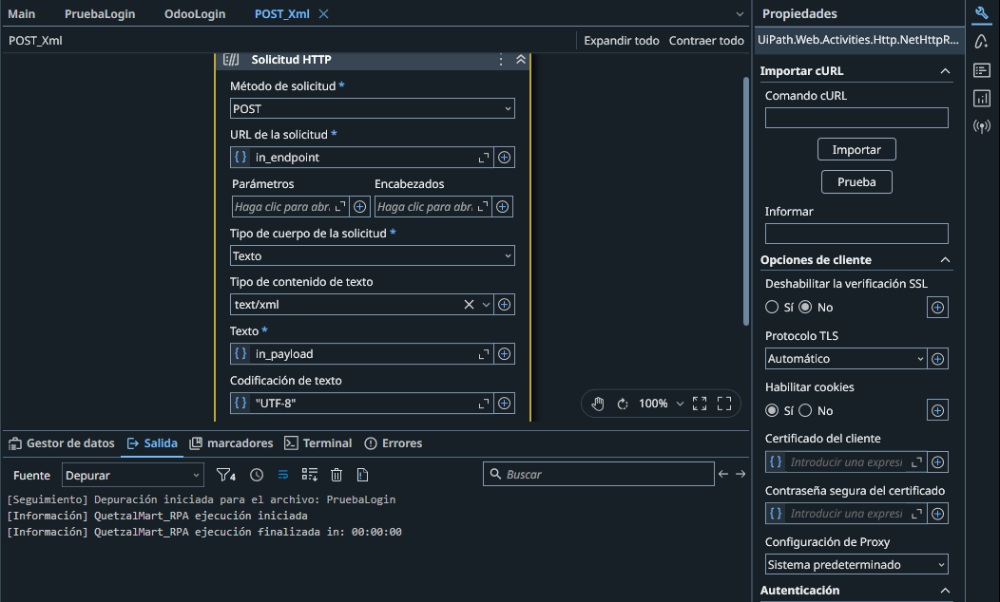
_Configuración de la Solicitud HTTP contra el endpoint XML-RPC de Odoo._

**`OdooLogin.xaml`:** arma el XML del método `authenticate` y devuelve el `uid`. Si la respuesta contiene un `fault` o no trae un entero, lanza una excepción con un mensaje claro.

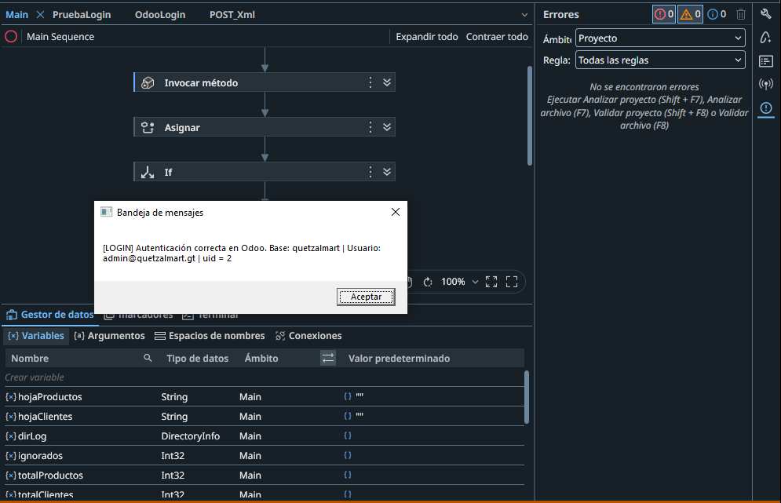
_Login exitoso: el bot obtiene el uid del usuario._

**`OdooExec.xaml`:** recibe el modelo (`res.partner`, `product.template`...), el método (`create`, `write`...) y los parámetros en XML. Construye el `execute_kw`, lo envía mediante `POST_Xml` y, si la respuesta trae un `fault`, lanza la excepción con el mensaje de Odoo. Un caso especial es `action_apply_inventory`, que devuelve `None` y provoca el mensaje `cannot marshal None`; ese caso se tolera porque la operación sí se aplica.

**`OdooSearch.xaml`:** arma un dominio `[campo = valor]`, ejecuta `search` mediante `OdooExec` y devuelve el id del primer resultado, o `0` si no existe.

> Los valores de texto se escapan una sola vez (`&`, `<`, `>`) en la preparación de cada fila, para que nombres como *Snacks & Bebidas* no rompan el XML.

#### Paso 2: Escaneo recursivo y detección de hojas

`Main.xaml` obtiene todos los archivos Excel de la carpeta de entrada y de sus subcarpetas, descartando los temporales de Excel (`~$`):

```vb
System.IO.Directory.GetFiles(in_ruta_entrada, "*.xls*", System.IO.SearchOption.AllDirectories)
```

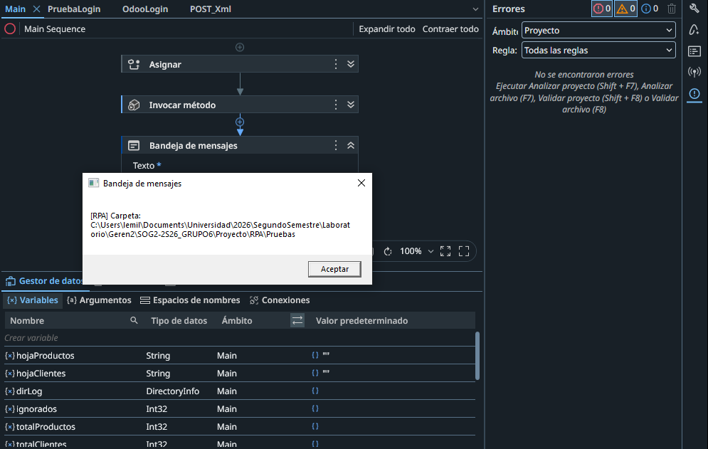
_Actividad de escaneo recursivo de la jerarquía de carpetas._

Para cada archivo, un **Invocar código** (`ListarHojas`) abre el `.xlsx` como archivo comprimido, lee `xl/workbook.xml` y devuelve el nombre exacto de las hojas `clientes` y `productos` sin distinguir mayúsculas. Si el archivo no tiene ninguna de las dos, se registra como `SKIP | Sin hojas clientes/productos` y el bot continúa con el siguiente.

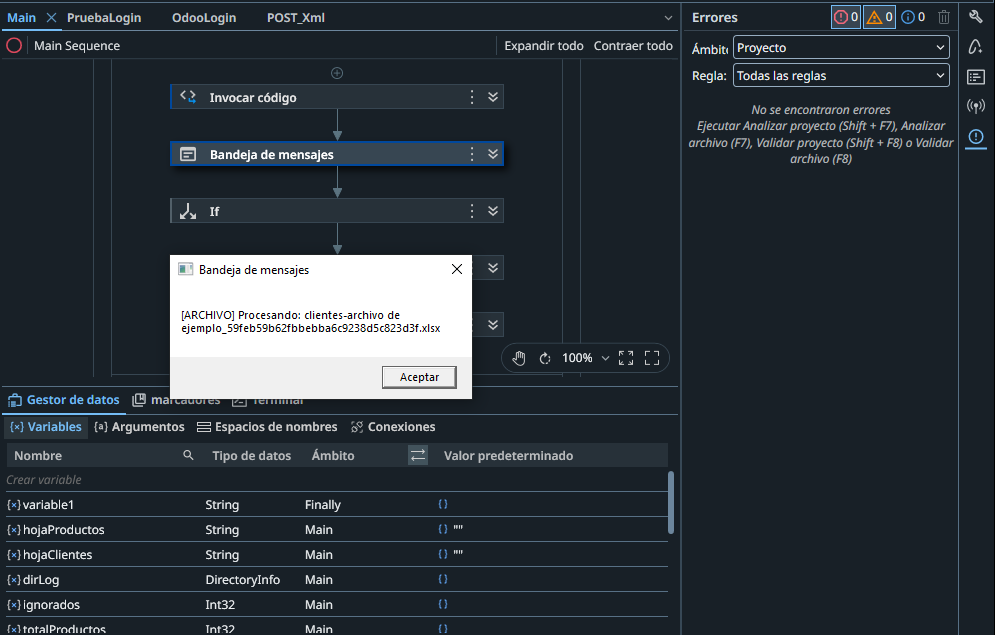
_Detección de las hojas dentro de cada archivo Excel._

#### Paso 3: Lectura de la hoja

Cada flujo (`ProcesarClientes`, `ProcesarProductos`) abre el archivo con **Utilice el archivo de Excel** (con *Crear si no existe* y *Guardar cambios* desactivados, porque solo se lee) y usa **Leer rango** sobre la hoja detectada, con la primera fila como encabezados. El resultado es un `DataTable`. Después se valida que exista la columna `Name` y que la hoja no esté vacía.

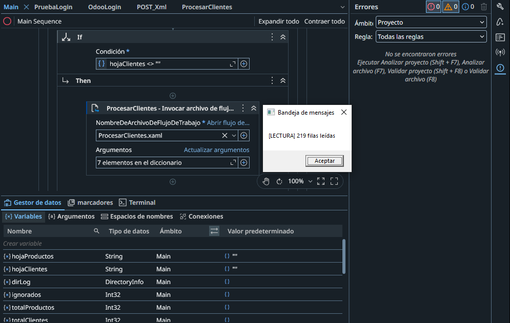
_Lectura de la hoja a un DataTable con encabezados._

#### Paso 4: Preparación de cada fila

Un **Invocar código** (`PrepararFila`) convierte cada fila en un diccionario `columna → valor` con tres ajustes importantes:

- **Normaliza los encabezados:** quita el `*` y los espacios (`Name*` pasa a `Name`), porque las plantillas de importación de Odoo marcan así los campos obligatorios.
- **Escapa los caracteres XML** (`&`, `<`, `>`).
- **Rellena con vacío** las columnas que falten, para evitar errores por claves inexistentes.

Además, las filas completamente vacías se ignoran sin registrar error.

#### Paso 5: Mapeo de columnas a campos de Odoo

**Hoja `clientes` → modelo `res.partner`:**

| Columna del Excel | Campo en Odoo |
| :--- | :--- |
| `Name` | `name` |
| `Company Type` | `company_type` (`company` o `person`) |
| `Related Company` | `parent_id` (búsqueda por nombre) |
| `Email`, `Phone` | `email`, `phone` |
| `Street`, `Street2` | `street`, `street2` |
| `City`, `Zip` | `city`, `zip` |
| `State` | `state_id` (búsqueda por nombre; si no existe se omite) |
| `Country` | `country_id` (búsqueda por nombre; si no existe se omite) |
| `Tax ID` | `vat` |
| `Website` | `website` |
| `Tags` | `category_id` (se busca la etiqueta y, si no existe, se crea) |
| `Reference` | `ref` |
| `Notes` | `comment` |

**Hoja `productos` → modelo `product.template` / `product.product`:**

| Columna del Excel | Campo en Odoo |
| :--- | :--- |
| `Name` | `name` |
| `Product Type` | `detailed_type` (`product` almacenable, `consu` consumible, `service`) |
| `Internal Reference` / `External ID` | `default_code` (código interno de la variante) |
| `Barcode` | `barcode` (variante) |
| `Sales Price` | `list_price` |
| `Cost` | `standard_price` |
| `Weight` | `weight` |
| `Sales Description` | `description_sale` |
| `Product Values` | `description` |
| `Está publicado` | `is_published` (acepta `TRUE`, `1`, `Sí`) |
| `Cantidad a la mano` | `stock.quant` (inventario inicial) |

#### Paso 6: Verificación de duplicados antes de crear

Para que el bot sea re-ejecutable sin duplicar, cada fila se consulta antes de crearse mediante `OdooSearch` (método `search` de Odoo):

- **Clientes:** se busca por `name` en `res.partner`.
- **Productos:** se busca por `barcode`, luego por código interno (`default_code`) y, por último, por `name`.

Si el registro ya existe, la fila se registra como `SKIP | DUPLICADO` y no se crea de nuevo.

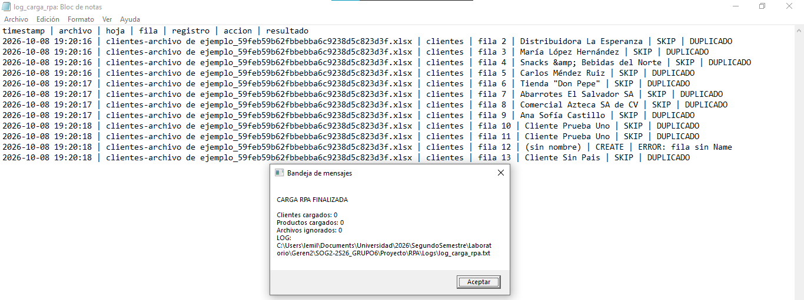
_Actividades de validación de duplicados._

#### Paso 7: Creación en Odoo mediante XML-RPC

Para clientes, el bot resuelve primero las llaves foráneas (país, estado, empresa relacionada, etiqueta) y arma el diccionario de campos con un **Invocar código**; luego `OdooExec` ejecuta `create` sobre `res.partner`.

Para productos se sigue un proceso en varios pasos:

1. `ArmarProducto` (Invocar código) valida los campos numéricos y arma los parámetros.
2. `create` sobre `product.template`.
3. `search` de la variante creada automáticamente (`product.product`).
4. `write` de `default_code` y `barcode` sobre la variante.
5. Si hay `Cantidad a la mano`, se crea un `stock.quant` en la ubicación de stock y se aplica con `action_apply_inventory`.

Ejemplo del tipo de petición que envía el bot (los datos sensibles se omiten):

```
POST http://<IP_DEL_SERVIDOR>:8069/xmlrpc/2/object
Content-Type: text/xml
```

```xml
<methodCall>
  <methodName>execute_kw</methodName>
  <params>
    <param><value><string>[BASE_DE_DATOS]</string></value></param>
    <param><value><int>2</int></value></param>             <!-- uid autenticado -->
    <param><value><string>********</string></value></param>
    <param><value><string>res.partner</string></value></param>
    <param><value><string>create</string></value></param>
    <param><value><array><data>
      <value><struct>
        <member><name>name</name><value><string>Carlos Roberto Méndez</string></value></member>
        <member><name>email</name><value><string>carlos.mendez@ejemplo.com</string></value></member>
      </struct></value>
    </data></array></value></param>
    <param><value><struct/></value></param>
  </params>
</methodCall>
```

*Nota: el login se realiza una sola vez al iniciar el bot y el `uid` se reutiliza en todo el proceso.*

#### Paso 8: Manejo de errores y datos inválidos

Cada fila se procesa dentro de un bloque `Try Catch`. Un fallo no detiene el bot: se registra en el LOG y continúa con la siguiente fila. Casos contemplados:

| Caso | Comportamiento | Registro en el LOG |
| :--- | :--- | :--- |
| Fila sin `Name` | No se crea | `CREATE \| ERROR: fila sin Name` |
| Registro ya existente | No se crea | `SKIP \| DUPLICADO` |
| `Sales Price`, `Cost` o `Weight` no numérico | No se crea el producto | `SKIP \| DATO INVALIDO: <campo y valor>` |
| País, estado o relación inexistente en Odoo | Se crea el registro sin ese campo | `CREATE \| OK` |
| Archivo sin hojas `clientes`/`productos` | Se omite el archivo | `SKIP \| Sin hojas clientes/productos` |
| Error de Odoo o de red en una fila | La fila se omite y continúa | `CREATE \| ERROR: <mensaje>` |
| Error en un archivo completo | Se registra y sigue con el siguiente archivo | `ERROR \| <mensaje>` |

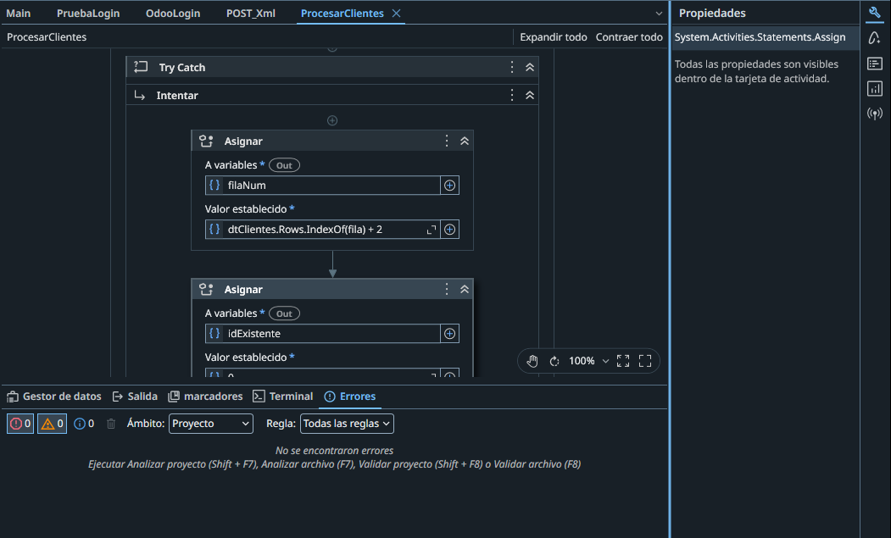
_Bloque Try Catch con manejo de excepciones por fila._

#### Paso 9: Archivo de trazabilidad (LOG)

Al finalizar (incluso si hubo errores), `Main` escribe el archivo `log_carga_rpa.txt` en la carpeta de logs, con campos separados por `|`:

| timestamp | archivo | hoja | fila | registro | accion | resultado |
| :--- | :--- | :--- | :--- | :--- | :--- | :--- |
| 2026-10-08 16:59:49 | clientes-archivo de ejemplo.xlsx | clientes | fila 2 | Distribuidora La Esperanza | CREATE | OK (id 141) |
| 2026-10-08 16:59:59 | clientes-archivo de ejemplo.xlsx | clientes | fila 10 | Cliente Prueba Uno | SKIP | DUPLICADO |
| 2026-10-08 17:00:00 | clientes-archivo de ejemplo.xlsx | clientes | fila 12 | (sin nombre) | CREATE | ERROR: fila sin Name |

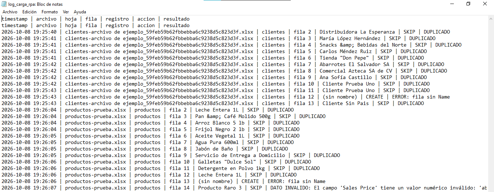
_Archivo LOG de trazabilidad generado por el bot._

---

### 10.5 Ejecución en Vivo del RPA

1. Abrir `QuetzalMart_RPA` en UiPath Studio y cambiar el argumento `in_ruta_entrada` a la carpeta entregada el día de la calificación.
2. Cerrar todos los archivos Excel de la carpeta.
3. Presionar **Ejecutar** (F5).
4. Observar el progreso en el panel **Salida** (login, archivos encontrados y cada acción realizada).
5. Al finalizar, el bot muestra un cuadro de resumen con los clientes y productos cargados, los archivos ignorados y la ruta del LOG.

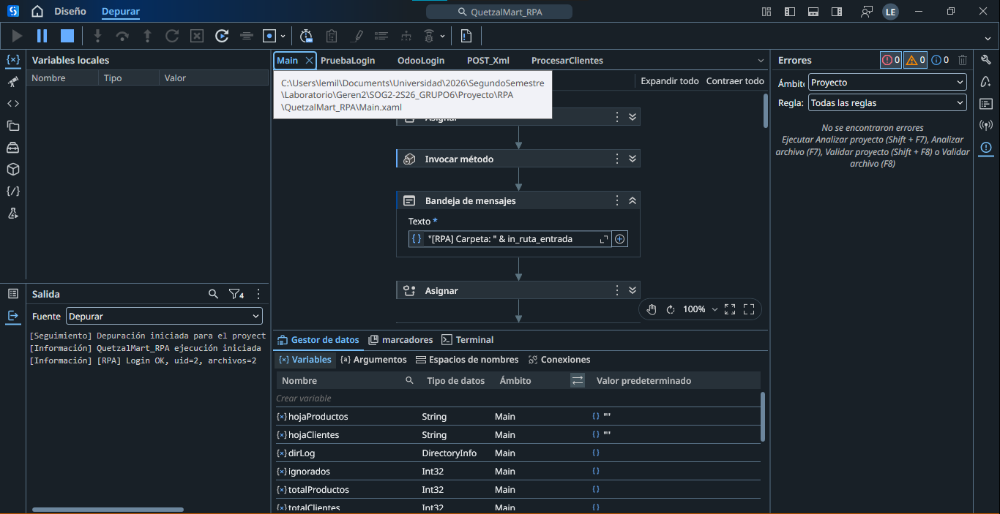
_Ejecución del bot en UiPath Studio._

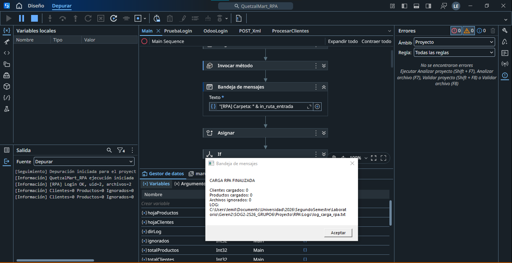
_Ventana de resumen final de la carga._

#### Resultados de las pruebas realizadas

| Prueba | Resultado |
| :--- | :--- |
| Archivo de clientes (12 filas) | 9 creados (ids 141 a 149), 2 `SKIP` por duplicado, 1 `ERROR` por fila sin nombre |
| Segunda ejecución con los mismos archivos | 0 creados: todas las filas existentes salen como `SKIP \| DUPLICADO` |
| Nombres con `&` y comillas | Creados correctamente y detectados como duplicados en la segunda corrida |
| Archivo de productos | *(completar con el resultado final de tu última corrida)* |
| Archivo sin hojas relevantes | `SKIP \| Sin hojas clientes/productos` |

---

### 10.6 Verificación de la Información Cargada (Web y Base de Datos)

El enunciado exige que la información cargada se visualice **tanto en el sitio web como a nivel de base de datos**.

#### 10.6.1 Verificación a nivel de sitio web (Odoo)

- **Aplicación Contactos:** muestra los clientes cargados con correos, teléfonos, direcciones, país y etiquetas.

  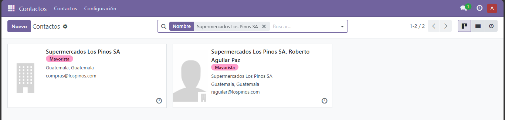
  _Clientes cargados por el bot visibles en Contactos._

- **Aplicación Inventario / Productos:** muestra los productos con precio, costo, código de barras y cantidad a la mano.

  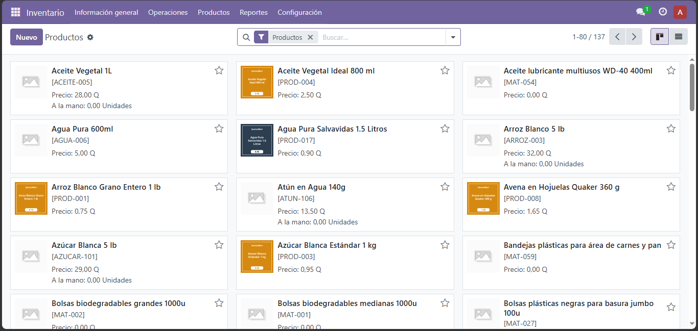
  _Productos cargados por el bot visibles en el catálogo._

#### 10.6.2 Verificación a nivel de base de datos (PostgreSQL)

> Estas consultas deben probarse antes de la calificación. Se filtra por fecha de creación y por el usuario con el que se autentica el bot (`create_uid`).

```sql
-- Cantidad de clientes creados hoy por el bot
SELECT COUNT(*) AS clientes_rpa
FROM res_partner
WHERE create_date >= CURRENT_DATE
  AND create_uid = 2;

-- Últimos 10 clientes cargados
SELECT id, name, email, phone, vat, ref, create_date
FROM res_partner
WHERE create_uid = 2
ORDER BY create_date DESC
LIMIT 10;

-- Cantidad de productos creados hoy por el bot
SELECT COUNT(*) AS productos_rpa
FROM product_template
WHERE create_date >= CURRENT_DATE
  AND create_uid = 2;

-- Últimos productos cargados, con su código interno y código de barras
SELECT pp.default_code, pp.barcode, pt.name, pt.list_price, pt.standard_price, pt.create_date
FROM product_template pt
JOIN product_product pp ON pp.product_tmpl_id = pt.id
WHERE pt.create_uid = 2
ORDER BY pt.create_date DESC
LIMIT 10;
```

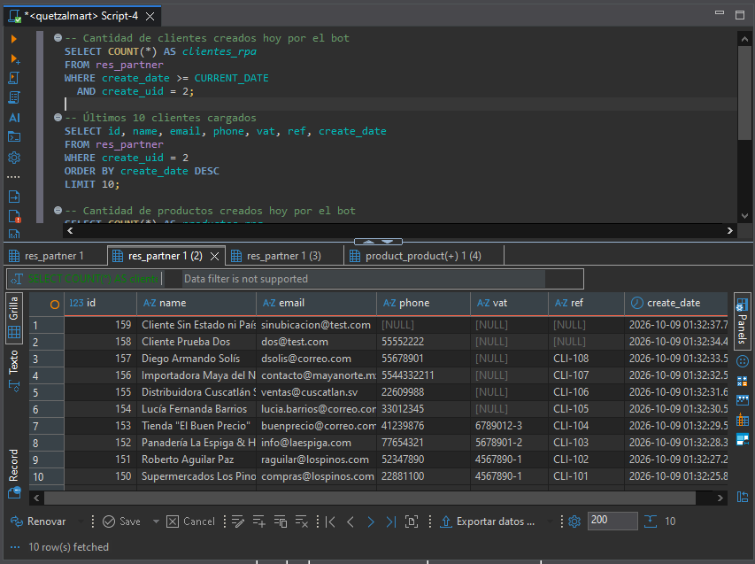
_Consultas SQL de verificación de los registros insertados por el bot en PostgreSQL._

---

### 10.7 Ventajas de Implementar el RPA en QuetzalMart

1. **Reducción drástica del tiempo de proceso:** la consolidación manual de la jerarquía de carpetas y la digitación de cientos de filas pasa de varias horas de trabajo humano a una ejecución de pocos minutos, liberando al personal para actividades de mayor valor estratégico.

2. **Reducción significativa de errores de digitación:** al no existir transcripción manual, disminuyen los errores de transposición de dígitos, campos incompletos o precios cargados incorrectamente, y los datos inválidos se detectan y registran en lugar de cargarse.

3. **Selección automática de la información relevante:** el bot solo extrae las hojas `clientes` y `productos`, ignorando hojas como reclamos o registros, sin que una persona revise archivo por archivo.

4. **Proceso re-ejecutable sin duplicados:** la verificación previa de existencia permite volver a correr el bot (por ejemplo, durante la calificación) sin contaminar la base de datos.

5. **Tolerancia a datos imperfectos:** normaliza encabezados (`Name*`), ignora filas vacías, omite países o etiquetas inexistentes sin perder el registro y continúa ante errores en filas o archivos individuales.

6. **Trazabilidad y auditoría completa:** el LOG registra fecha, archivo, hoja, fila, registro y resultado de cada operación, lo que facilita el control de calidad y la resolución de incidencias.

7. **Escalabilidad:** ante la expansión de QuetzalMart a nuevas sucursales, basta con depositar los nuevos archivos en la carpeta de entrada para que el bot los procese sin modificar la automatización.

8. **Centralización de la información:** los datos dispersos en carpetas locales se consolidan en el ERP en la nube, disponibles de inmediato para el sitio web, los reportes y la toma de decisiones.

## 11. Recursos Humanos y Gestor Documental

### 11.1 Alcance

Esta sección describe el trabajo realizado desde el navegador sobre la instalación de Odoo del proyecto. Comprende:

- La carga de **35 empleados**, distribuidos en **5 departamentos** y **6 cargos**.
- La organización de **15 documentos** en el gestor documental: 5 facturas de proveedores, 5 contratos de outsourcing y 5 contratos de empleados.

Los registros de empleados y los contratos preparados para esta práctica contienen **datos ficticios con fines académicos**.

---

### 11.2 Funcionamiento de los módulos

#### 11.2.1 Recursos humanos (módulo Empleados)

El módulo Empleados permite consultar y administrar los registros de personal. Cada ficha incluye el nombre, el correo laboral, el departamento y el puesto de trabajo. La distribución por departamentos y cargos facilita identificar a qué área pertenece cada empleado.

La importación permite cargar los registros desde una hoja de cálculo. Los identificadores externos incluidos en el archivo ayudan a reconocer los registros cuando se realizan actualizaciones mediante importación.

#### 11.2.2 Gestor documental (módulo Documentos, DMS de OCA)

El módulo Documentos centraliza los archivos del proyecto:

| Elemento | Función |
| :--- | :--- |
| **Almacenamiento** | Define dónde se guardan los archivos (en este proyecto, la base de datos) |
| **Carpetas** | Organizan los documentos según su uso |
| **Categorías** | Establecen la clasificación del archivo |
| **Etiquetas** | Permiten identificar y filtrar los documentos |
| **Grupos de acceso** | Controlan las acciones disponibles sobre las carpetas y sus archivos |

En la configuración de QuetzalMart se habilitó la creación y modificación para el grupo responsable de la administración documental.

---

### 11.3 Configuración de los módulos

#### 11.3.1 Acceso al sistema

La configuración se realizó desde el navegador, con la cuenta **Administrator** de la base de datos de QuetzalMart. Se trabajó con el módulo **Empleados** y con el gestor documental **Documentos** (módulo DMS de OCA), disponible en la instalación del proyecto.

#### 11.3.2 Configuración de recursos humanos

1. Ingresar a Odoo con la cuenta autorizada.
2. Acceder a **Aplicaciones** y activar el módulo **Empleados**.
3. Abrir el módulo **Empleados**.
4. Ingresar a **Configuración → Departamentos** y crear o comprobar los departamentos de la empresa.
5. Ingresar a **Configuración → Puestos de trabajo** y crear los seis cargos que utilizarán los registros importados.

Distribución utilizada:

| Departamento | Cargo | Empleados cargados |
| :--- | :--- | :---: |
| Administración | Gerente administrativo | 3 |
| Ventas y Atención al Cliente | Cajero | 10 |
| Ventas y Atención al Cliente | Asesor de ventas | 8 |
| Compras | Encargado de compras | 4 |
| Inventario y Logística | Auxiliar de bodega | 7 |
| Recursos Humanos | Analista de Recursos Humanos | 3 |
| **Total** | **6 cargos en 5 departamentos** | **35** |

> En la base utilizada, el departamento de Administración aparece con el nombre **Administration**. El archivo de importación usa ese nombre para asociar a los empleados con el departamento existente.


#### 11.3.3 Almacenamiento del gestor documental

1. Abrir **Documentos**.
2. Ingresar a la configuración de almacenamientos.
3. Crear el almacenamiento **Documentos QuetzalMart**.
4. Seleccionar **Base de datos** como tipo de guardado.
5. Asociarlo a la empresa **QuetzalMart** y guardar.

Este almacenamiento conserva los archivos dentro de la base de datos utilizada por el sistema.

#### 11.3.4 Permisos y estructura de carpetas

Se configuró el grupo **Administración documental QuetzalMart**, incluyendo al usuario Administrator. Se habilitaron los permisos de **creación** y **escritura**; el permiso de **eliminación** quedó desactivado.

Para establecer la estructura:

1. Acceder a **Documentos → Carpetas**.
2. Crear la carpeta **QuetzalMart** y marcarla como carpeta raíz.
3. Seleccionar el almacenamiento **Documentos QuetzalMart**.
4. En la pestaña de grupos, agregar **Administración documental QuetzalMart** y guardar.
5. Crear dentro de la raíz las carpetas **Facturas de proveedores**, **Contratos de outsourcing** y **Contratos de empleados**.
6. En cada subcarpeta, seleccionar **QuetzalMart** como carpeta padre, mantener desmarcada la opción de carpeta raíz y habilitar la herencia de grupos.
7. Guardar cada registro.

Notas:

- En esta interfaz, el campo que identifica la carpeta padre puede aparecer como **Categoría padre**. Se usa para establecer la jerarquía de carpetas; la categoría de clasificación del archivo se asigna por separado.
- Durante la configuración inicial se presentó una restricción para crear carpetas. Se resolvió asignando el grupo documental con permisos de creación y escritura a la carpeta raíz.

#### 11.3.5 Categorías y etiquetas

Desde **Documentos → Configuración → Categorías** se crearon las tres categorías. Después, desde **Configuración → Etiquetas**, se crearon las etiquetas y se asociaron a su categoría.

| Carpeta | Categoría del archivo | Etiqueta | Cantidad |
| :--- | :--- | :--- | :---: |
| Facturas de proveedores | Facturas de proveedores | Compra | 5 |
| Contratos de outsourcing | Contratos de outsourcing | Servicio externo | 5 |
| Contratos de empleados | Contratos de empleados | RRHH | 5 |
| **Total** | | | **15** |

---

### 11.4 Carga de datos y documentos

#### 11.4.1 Importación masiva de los 35 empleados

Se utilizó el archivo `empleados_quetzalmart_35.xlsx`, con estas columnas:

| Columna | Información |
| :--- | :--- |
| `External ID` | Identificador externo único, desde `quetzalmart_emp_001` hasta `quetzalmart_emp_035` |
| `Name` | Nombre del empleado |
| `Work Email` | Correo de ejemplo para la práctica |
| `Department` | Nombre del departamento existente |
| `Job Position` | Nombre del puesto de trabajo existente |
| `Notes` | Indicación de que el registro es ficticio y académico |

Procedimiento:

1. Abrir el listado de **Empleados**.
2. Seleccionar **Importar registros** en el menú del listado.
3. Cargar el archivo Excel.
4. Revisar que cada columna esté asociada al campo correspondiente de Odoo.
5. Comprobar que los departamentos y puestos coincidan con los registros creados previamente.
6. Ejecutar **Importar** y revisar los empleados creados.

La carga contiene **35 empleados**. Si el listado incluye también al empleado Administrator creado previamente, puede mostrar 36 registros; ese registro adicional no forma parte de los 35 importados.

#### 11.4.2 Generación de las cinco facturas de proveedores

Se utilizaron las compras existentes **P00100, P00099, P00098, P00097 y P00096** para obtener las cinco facturas destinadas al gestor documental.

Para cada compra:

1. Abrir la orden desde **Compras**.
2. Acceder a su recepción y comprobar las cantidades recibidas.
3. Validar la recepción de los productos.
4. Regresar a la orden y seleccionar **Crear factura**.
5. Revisar el proveedor, los productos, las cantidades y los importes.
6. Completar la fecha de factura y la referencia de la orden (para P00100 se utilizó `SIM-P00100`).
7. Confirmar la factura después de revisar sus datos.
8. Usar **Imprimir → Facturas sin pago** y guardar el PDF.

Los PDF se identificaron con nombres como `Factura_proveedor_P00100.pdf` y se utilizaron como documentos de respaldo en la carpeta **Facturas de proveedores**.

| Compra | Archivo PDF | Número de factura | Fecha | Total |
| :--- | :--- | :--- | :--- | :--- |
| P00100 | `Factura_proveedor_P00100.pdf` | FACTU/2026/10/0001 | 08/10/2026 | Q165.20 |
| P00099 | `Factura_proveedor_P00099.pdf` | *P00099* | *08/10/2026* | *Q. 622.00* |
| P00098 | `Factura_proveedor_P00098.pdf` | *P00098* | *08/10/2026* | *Q. 372.50* |
| P00097 | `Factura_proveedor_P00097.pdf` | *P00097* | *08/10/2026* | *Q. 189.25* |
| P00096 | `Factura_proveedor_P00096.pdf` | *P00096* | *08/10/2026* | *Q. 2281.90* |


#### 11.4.3 Preparación de los contratos

Se prepararon **diez contratos en PDF** para la práctica:

- **Cinco contratos de outsourcing:** limpieza, seguridad, soporte de tecnología, transporte y mantenimiento.
- **Cinco contratos de empleados:** con datos de personal incluido en la carga de recursos humanos.

Los documentos se identificaron como ejemplos académicos con datos ficticios y se cargaron individualmente en formato PDF dentro de sus carpetas correspondientes.

#### 11.4.4 Carga y clasificación de los 15 archivos

1. Abrir la carpeta correspondiente en **Documentos → Carpetas**.
2. Acceder a la pestaña **Archivos** y seleccionar **Agregar una línea**.
3. Escribir el nombre del documento.
4. En **Contenido**, usar **Sube tu archivo** para seleccionar el PDF.
5. Comprobar la carpeta y el almacenamiento asignados.
6. Seleccionar la categoría y la etiqueta indicadas en la tabla del apartado 11.3.5.
7. Usar **Guardar y crear nuevo** para continuar cargando archivos, o **Guardar y cerrar** al terminar.
8. Guardar también el registro de la carpeta para confirmar los cambios de su tabla de archivos.
9. Revisar la lista de archivos cargados en cada carpeta.

> Guardar la carpeta es necesario cuando las filas agregadas todavía están pendientes de confirmación. Antes de guardar, la tabla puede mostrar archivos que aún no se reflejan en el contador del registro.

---

### 11.5 Resumen de resultados

| Elemento | Cantidad | Dónde verificarlo |
| :--- | :---: | :--- |
| Departamentos | 5 | Empleados → Configuración → Departamentos |
| Cargos | 6 | Empleados → Configuración → Puestos de trabajo |
| Empleados importados | 35 | Listado de Empleados |
| Facturas de proveedores | 5 | Documentos → carpeta Facturas de proveedores |
| Contratos de outsourcing | 5 | Documentos → carpeta Contratos de outsourcing |
| Contratos de empleados | 5 | Documentos → carpeta Contratos de empleados |
| **Documentos en total** | **15** | Documentos → Archivos |