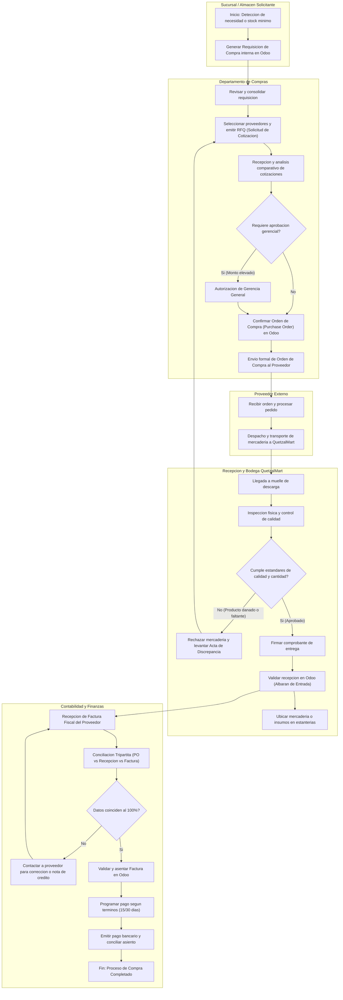
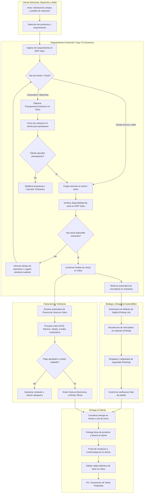

# Manual 2 - Diagramas de Flujo de Procesos de Negocio
## QuetzalMart ERP - Sección Compras y Ventas (Integrante 1)

Este documento contiene la descripción exhaustiva y los diagramas de flujo interactivos en **Mermaid** para los procesos de **Compras a Proveedores** y **Ventas de Productos**, tal como lo estipula el enunciado del proyecto.

---

## 1. Proceso de Compras a Proveedores

### 1.1 Descripción Detallada del Proceso

El proceso de compras de la cadena QuetzalMart está diseñado para abastecer tanto mercadería para venta (alimentos, bebidas, abarrotes) como materiales e insumos operativos requeridos para el funcionamiento de sus sucursales (Guatemala Central, Sucursal México y Sucursal El Salvador).

1. **Detección de Necesidad y Requisición:**
   - La sucursal o el departamento de inventario detecta un nivel bajo de existencias (stock mínimo alcanzado) o una solicitud especial de insumos operativos (materiales de empaque, rollos POS, limpieza).
   - Se genera una **Requisición de Compra interna** en el ERP Odoo.

2. **Gestión de Compras y Solicitud de Cotizaciones (RFQ):**
   - El encargado de compras evalúa la solicitud y genera **Solicitudes de Presupuesto (RFQ)** a uno o más proveedores registrados en el catálogo.
   - Los proveedores envían sus cotizaciones con precios, tiempos de entrega y condiciones de crédito.

3. **Comparativa y Aprobación de Orden de Compra (PO):**
   - Compras compara condiciones y selecciona la oferta óptima.
   - Si el monto excede el límite operativo estándar, pasa por autorización gerencial.
   - Se confirma la orden en Odoo, pasando a estado **Orden de Compra Confirmada (Purchase Order)**. Se notifica formalmente al proveedor vía correo electrónico.

4. **Recepción de Mercadería y Control de Calidad:**
   - El transportista del proveedor arriba a la bodega de la sucursal correspondiente.
   - El equipo de recepción realiza la verificación física de bultos contra la orden de compra y la nota de entrega del proveedor.
   - **Control de Calidad:** Se inspecciona el estado de los productos (fechas de caducidad, empaques íntegros, especificaciones correctas).
     - **Si se detectan anomalías:** Se rechaza el lote dañado, se emite un acta de discrepancia y se solicita reposición o nota de crédito.
     - **Si es conforme:** Se valida la recepción en Odoo, generando el movimiento de entrada en inventario (*Albarán / Stock Picking*).

5. **Recepción y Conciliación de Factura (3-Way Matching):**
   - El proveedor entrega la factura fiscal.
   - Contabilidad realiza el cruce tripartito en Odoo:
     1. Orden de Compra original.
     2. Albarán de recepción de bodega efectivamente recibido.
     3. Factura del proveedor (cantidades y precios unitarios).
   - Si concuerda, la factura se valida y se contabiliza en las cuentas por pagar de la empresa.

6. **Programación y Ejecución del Pago:**
   - Finanzas programa el pago según las condiciones pactadas (contado, 15, 30 o 60 días).
   - Se realiza la transferencia bancaria o cheque y se registra el comprobante de pago en el módulo contable de Odoo, cerrando la orden de compra.

---

### 1.2 Diagrama de Flujo: Compras a Proveedores (Mermaid)

---

## 2. Proceso de Ventas de Productos

### 2.1 Descripción Detallada del Proceso

El proceso de ventas de QuetzalMart abarca tanto la atención presencial en salas de venta y supermercados, la atención a clientes mayoristas/corporativos (con presupuestos y cotizaciones formales), como la integración de pedidos provenientes del portal web de e-commerce.

1. **Recepción del Requerimiento / Solicitud del Cliente:**
   - El cliente se presenta en tienda, solicita una cotización formal (clientes mayoristas/empresas) o realiza una solicitud mediante el canal comercial.
   - En ventas corporativas o grandes volúmenes, el asesor comercial elabora un **Presupuesto / Cotización (`sale.order` en estado borrador)** con validez temporal y precios preferenciales.

2. **Verificación de Inventario y Disponibilidad:**
   - El sistema ERP Odoo verifica en tiempo real la disponibilidad de stock en el almacén de la sucursal seleccionada (Guatemala, México o El Salvador).
   - Si no hay existencia suficiente, se notifica al cliente con alternativas de fecha de entrega o se solicita reposición interna de bodega central.

3. **Confirmación de la Orden de Venta:**
   - El cliente acepta la cotización o realiza la compra directa.
   - La orden pasa al estado **Pedido de Venta Confirmado (`sale.order`)**.
   - Odoo reserva de inmediato las unidades en inventario para evitar desabastecimiento o sobreventa.

4. **Preparación del Pedido (Picking y Packing):**
   - El almacén recibe la orden de recolección (*Picking*).
   - El personal de bodega recolecta los artículos de las góndolas/estanterías y realiza el empaque (*Packing*) con los materiales de embalaje de QuetzalMart.
   - Se realiza una verificación de bultos y etiquetado final.

5. **Facturación y Cobro:**
   - El sistema genera la **Factura de Venta (`account.move`)**.
   - Se procesa el cobro a través del medio de pago seleccionado:
     - Efectivo o terminal POS en tienda física.
     - Pasarela de pago en pedidos web.
     - Transferencia bancaria o crédito acordado (15/30 días) para clientes corporativos.
   - El comprobante fiscal y factura electrónica se entrega físicamente o se remite por correo electrónico.

6. **Despacho, Entrega y Cierre:**
   - El pedido se entrega al cliente en mostrador o se despacha mediante la unidad de transporte/envío a domicilio.
   - El cliente firma el acuse de recibo conforme.
   - El albarán de salida se valida en Odoo, rebajando definitivamente el inventario físico y contable.
   - Fin del ciclo de venta.

---

### 2.2 Diagrama de Flujo: Ventas de Productos (Mermaid)

---

## 3. Puntos de Auditoría y Verificación en el ERP Odoo

Para corroborar la correcta ejecución de estos dos flujos en la calificación del proyecto:

| Proceso | Modelo / Objeto Odoo | Tabla Base de Datos | Estado Requerido |
| :--- | :--- | :--- | :--- |
| **Compras Realizadas** | `purchase.order` | `purchase_order` | `purchase` / `done` (Mínimo 100 registros) |
| **Facturas de Compras** | `account.move` | `account_move` | `move_type = 'in_invoice'`, `posted` |
| **Cotizaciones de Compra** | `purchase.order` | `purchase_order` | `draft` / `sent` (Mínimo 10 solicitudes) |
| **Cotizaciones de Venta** | `sale.order` | `sale_order` | `draft` / `sent` (Mínimo 10 presupuestos) |
| **Ventas Confirmadas** | `sale.order` | `sale_order` | `sale` / `done` (Mínimo 150 órdenes) |
| **Facturas de Ventas** | `account.move` | `account_move` | `move_type = 'out_invoice'`, `posted` |
| **Materiales e Insumos** | `product.product` | `product_product` | `default_code LIKE 'MAT-%'` (Mínimo 60) |
