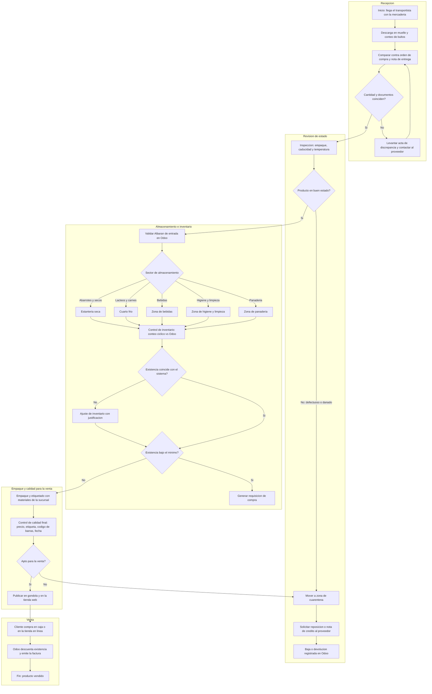
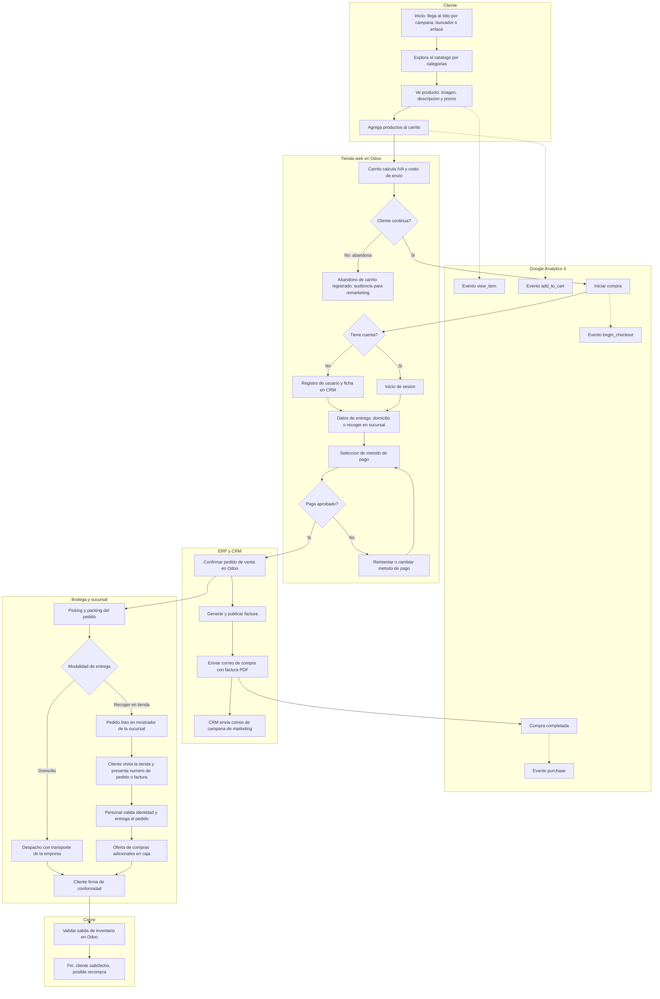

# Manual 2 - Diagramas de Flujo (Sección Integrante 2)
## QuetzalMart - Flujo del producto en la empresa y flujo del cliente web/tienda

Este documento complementa a `Manual2.md` (Compras y Ventas). Al unificar el PDF final, agregar estas secciones al Manual 2.

---

## 1. Flujo de proceso de la empresa: desde que entra un producto hasta que se vende

### 1.1 Descripción detallada

1. **Recepción del producto:** el transportista llega al muelle de descarga de la sucursal. El encargado de bodega verifica los bultos contra la orden de compra y la nota de entrega del proveedor.
2. **Productos defectuosos o en mal estado:** se revisa empaque, fecha de caducidad y temperatura (refrigerados). Lo que no cumple se separa en la zona de cuarentena, se levanta un acta de discrepancia y se solicita reposición o nota de crédito al proveedor. Lo dañado nunca entra al inventario vendible.
3. **Registro en el ERP:** la mercadería conforme se valida en Odoo (Albarán de entrada), lo que genera el movimiento de inventario y aumenta la existencia.
4. **Almacenamiento por sector:** cada producto se ubica según su tipo: secos/abarrotes, refrigerados (lácteos y carnes), bebidas, higiene y limpieza, panadería. Se respeta la regla FEFO (primero en vencer, primero en salir).
5. **Control de inventario:** conteos cíclicos por sector y comparación contra Odoo. Si hay diferencia se ajusta el inventario con justificación; si la existencia baja del mínimo se dispara una nueva requisición de compra.
6. **Empaque:** para pedidos web se hace picking y packing con materiales de empaque (bolsas, cajas, etiquetas); para piso de venta se rotula y se coloca en góndola.
7. **Control de calidad para ponerlo a la venta:** última inspección (precio, etiqueta, código de barras, fecha). Si pasa, se publica en tienda física y en la tienda web; si no, regresa a cuarentena.
8. **Venta:** el producto se vende en caja (POS) o en la tienda en línea; Odoo descuenta la existencia y genera la factura.

### 1.2 Diagrama

---

## 2. Flujo del cliente que compra por la web y visita la tienda

### 2.1 Descripción detallada

1. **Ingreso al sitio:** el cliente llega por una campaña, buscador o enlace directo; se registran sus eventos en Google Analytics (`view_item`, `add_to_cart`, `begin_checkout`, `purchase`).
2. **Exploración del catálogo:** navega por categorías, ve imágenes, descripción y precio de cada producto.
3. **Carrito:** agrega o elimina productos; el sistema calcula IVA y costo de envío (gratis sobre el monto mínimo). Si abandona el carrito queda registrado y alimenta la audiencia de "abandono de carrito".
4. **Identificación:** inicia sesión o se registra; su ficha de cliente queda en el ERP/CRM.
5. **Pago:** elige el método (pasarela de pago o transferencia). Si el pago falla, puede reintentar o cambiar de método.
6. **Confirmación y facturación:** Odoo confirma el pedido, genera y publica la factura y envía el correo de compra con la factura en PDF. Poco después el CRM envía el correo de campaña de marketing.
7. **Entrega o recojo:** el cliente elige envío a domicilio o recoger en sucursal. La bodega prepara el pedido (picking y packing).
8. **Visita a la tienda:** al recoger o visitar la sucursal presenta su número de pedido o factura; el personal valida la identidad, entrega el pedido y puede ofrecer compras adicionales en caja.
9. **Cierre:** el cliente firma de conformidad, Odoo valida la salida del inventario y se invita a registrar una reseña o volver a comprar.

### 2.2 Diagrama

