# Manual 3: Google Analytics 4 e Inteligencia de Negocio

## Proyecto QuetzalMart - Sistemas Operativos 2

> Las imágenes se encuentran en `../Integrante3-GA4-BI/capturas/` (y respaldadas en `./imagenes/`). Donde aparece **[COMPLETAR]** va un dato o interpretación que solo se conoce después de ver los reportes reales de GA4. No se inventan cifras.

---

## 1. Objetivo

Medir el comportamiento de los visitantes de la tienda en línea de QuetzalMart (Odoo 17, sitio `http://3.140.234.169:8069`) con **Google Analytics 4 (GA4)** bajo el modelo de **comercio electrónico mejorado**, y convertir esos datos en información para decidir: qué canales y campañas traen compradores, dónde abandonan los clientes el proceso de compra, qué productos venden más y qué páginas generan rebote.

---

## 2. Conexión de GA4 con el sitio web

### 2.1 Crear la cuenta, la propiedad y el flujo de datos

1. Entrar a <https://analytics.google.com> con la cuenta del proyecto.
2. **Administrar > Crear > Cuenta**: nombre `QuetzalMart`.
3. **Crear propiedad**: nombre `QuetzalMart Tienda`, zona horaria *Guatemala*, moneda *Quetzal guatemalteco (GTQ)*.
4. Categoría: *Comercio / Alimentos y bebidas*; objetivo: *Aumentar las ventas en línea*.
5. **Flujo de datos > Web**: URL `http://3.140.234.169:8069`, nombre `Tienda QuetzalMart`. Dejar activada la **medición mejorada**.
6. Copiar el **ID de medición** (`G-W3XFZJZFCZ`).

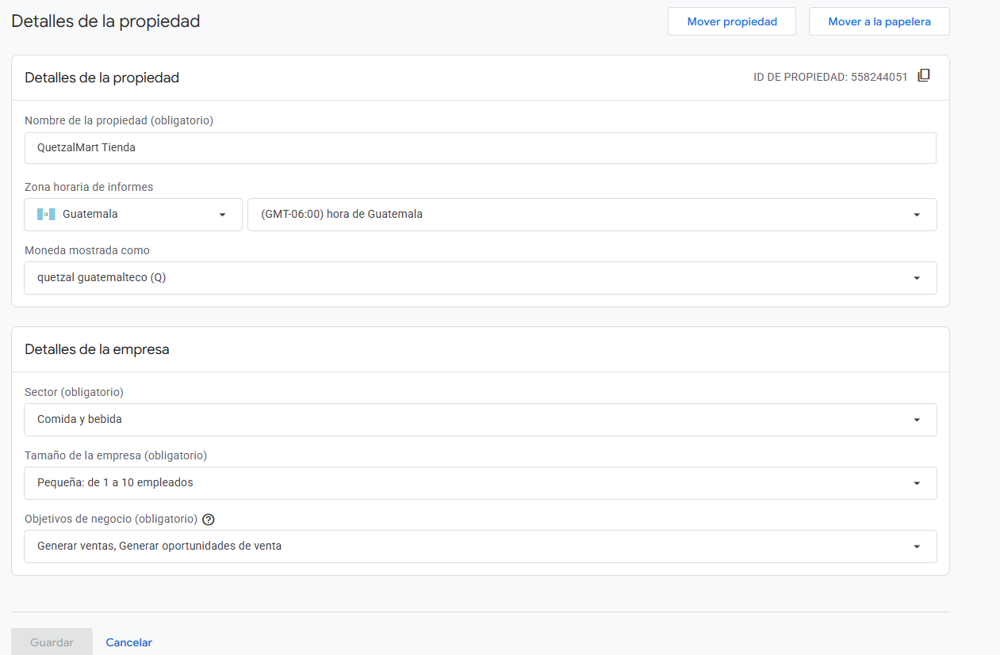
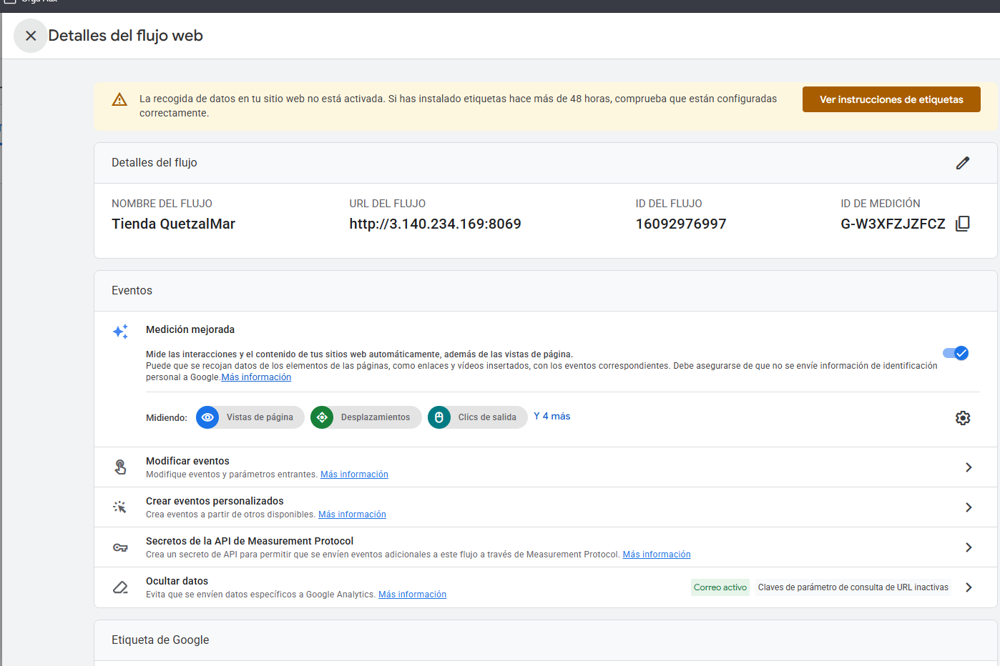

### 2.2 Insertar la etiqueta en Odoo

Odoo incluye el campo nativo *Google Analytics* en el sitio web. Se puede hacer de dos formas.

**Opción A, por interfaz:** Sitio web > Configuración > Ajustes > *Seguimiento* > activar **Google Analytics** y pegar el ID de medición.

**Opción B, por script** (reproducible, usa la API XML-RPC como el resto del proyecto):

```bash
cd Proyecto/Integrante3-GA4-BI
python 01_conectar_ga4.py --id G-W3XFZJZFCZ --sin-banner-cookies
```

El script escribe el ID en el campo `google_analytics_key` del modelo `website`. La opción `--sin-banner-cookies` desactiva el banner de cookies de Odoo, porque con el banner activo la etiqueta solo se carga cuando el visitante acepta las cookies (y el auxiliar no lo haría en la calificación).

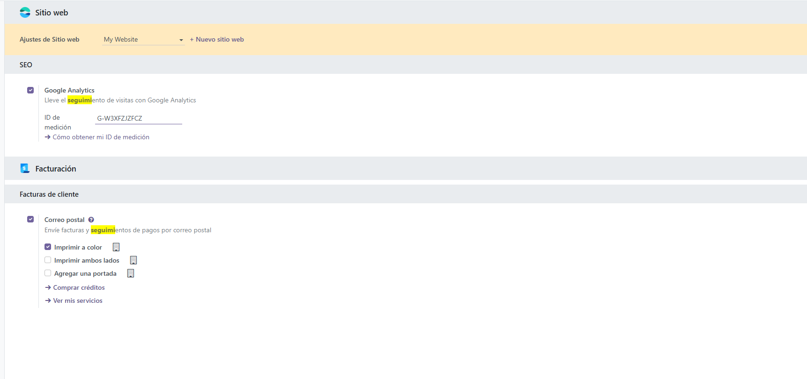

### 2.3 Verificación

1. En GA4: **Informes > Tiempo real**.
2. Abrir el sitio en otra pestaña y navegar. Debe aparecer al menos 1 usuario activo.
3. (Opcional) **Administrar > DebugView** con la extensión *Google Analytics Debugger*; debe verse `view_item`, `add_to_cart`, `begin_checkout` y `purchase` al comprar.

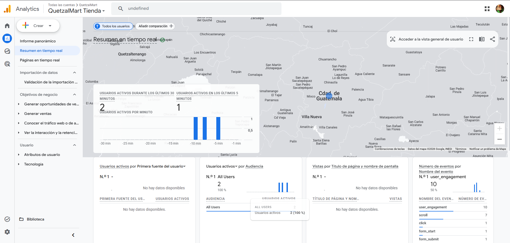

---

## 3. Configuración de eventos

### 3.1 Eventos que ya recopila el sitio

| Origen | Eventos |
| :--- | :--- |
| Automáticos y medición mejorada | `page_view`, `session_start`, `first_visit`, `scroll`, `click`, `view_search_results`, `form_start`, `form_submit` |
| Comercio electrónico (módulo `website_sale` de Odoo) | **`view_item`**, **`add_to_cart`**, `remove_from_cart`, **`begin_checkout`**, `add_payment_info`, **`purchase`** |

Los cuatro eventos en negrita son los exigidos por el enunciado.

### 3.2 Eventos creados y eventos clave

En **Administrar > Visualización de datos > Eventos > Crear evento** se definieron:

| Evento nuevo | Evento de origen | Condiciones | Para qué sirve |
| :--- | :--- | :--- | :--- |
| `generate_lead` | `page_view` | `page_location` **contiene** `/contactus-thank-you` | Cuenta cada formulario de contacto enviado (lead del CRM) |
| `ver_catalogo` | `page_view` | `page_location` **contiene** `/shop` y **no contiene** `/shop/cart` | Mide el interés en el catálogo |
| `ver_carrito` | `page_view` | `page_location` **contiene** `/shop/cart` | Mide intención de compra |

Marcados como **evento clave**: `purchase`, `generate_lead` y `begin_checkout`.

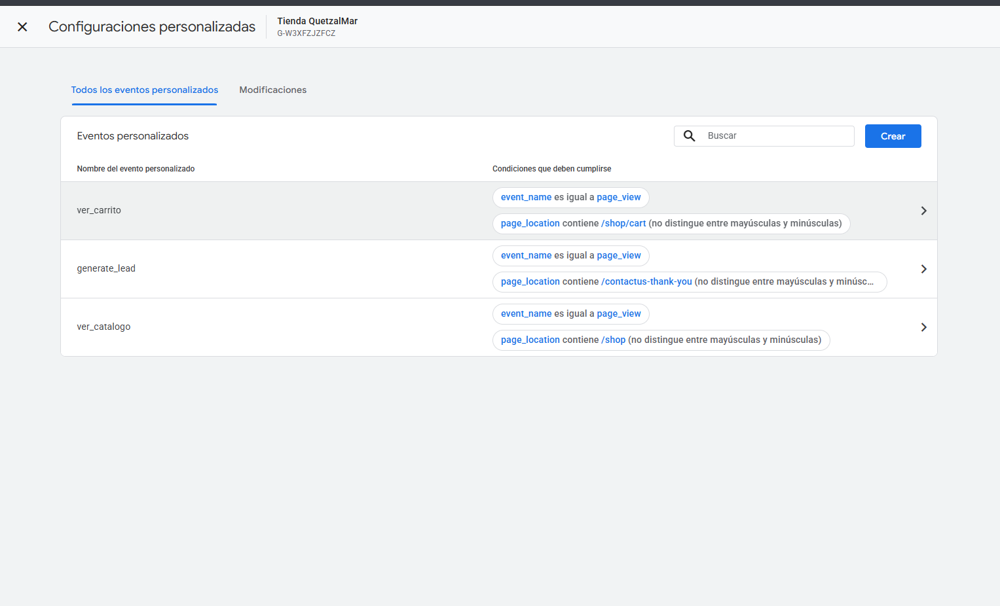
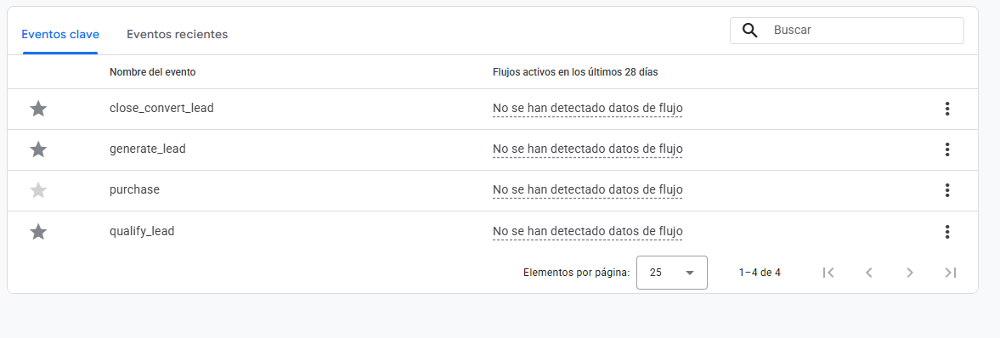

### 3.3 Medición de la campaña de marketing (UTM)

El correo de la campaña (`03_configurar_correo.py`) enlaza a la tienda con parámetros UTM:

```
/shop?utm_source=quetzalmart&utm_medium=email&utm_campaign=gracias_por_tu_compra&utm_content=boton_tienda
```

`utm_content` distingue el botón *Ir a la tienda* de las tarjetas de categoría (`alimentos`, `bebidas`, `lacteos`). Así GA4 atribuye las visitas y compras que vienen del correo al canal **Email** y se puede medir la efectividad de la campaña en **Adquisición de tráfico**.


---

## 4. Segmentos

Se crean en **Explorar** (dentro de una exploración, sección *Segmentos* > `+`). Solo filtran los datos de esa exploración.

### 4.1 Segmentos de usuarios (3)

| # | Segmento | Definición | Pregunta de negocio |
| :-: | :--- | :--- | :--- |
| U1 | **Compradores** | Usuarios con el evento `purchase` | ¿Cómo se comportan quienes compran? |
| U2 | **Abandono de carrito** | Incluir usuarios con `add_to_cart`; **excluir** usuarios con `purchase` | ¿Cuántos clientes potenciales se pierden y por qué canal llegaron? |
| U3 | **Usuarios móviles de campañas** | Categoría de dispositivo = `mobile` **y** medio coincide con `social\|email\|cpc` | ¿Las campañas rinden bien en móvil? |

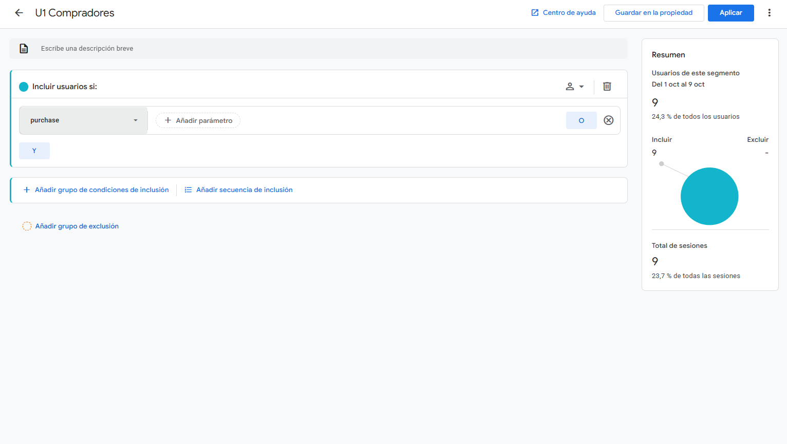
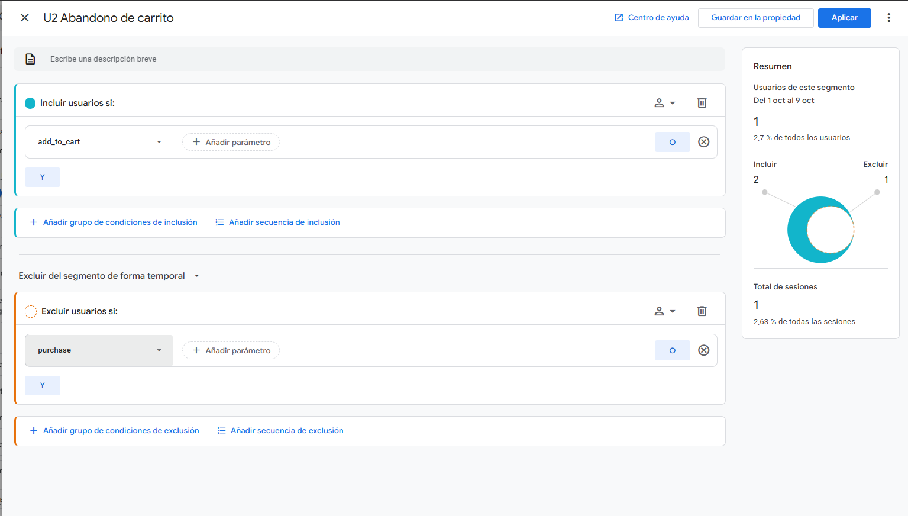
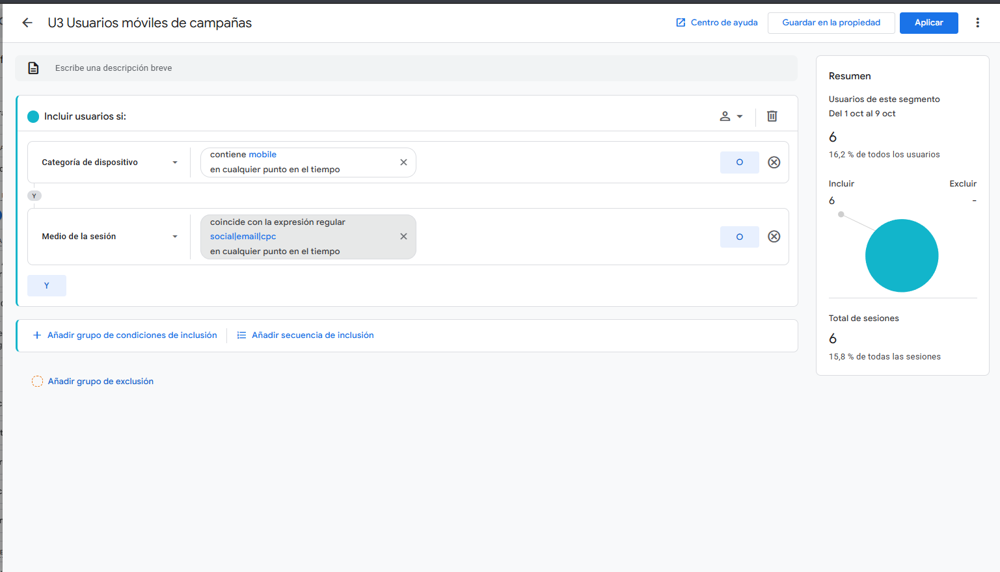

### 4.2 Segmentos de eventos (5)

Se crean como *Segmento de eventos* (ámbito: evento) en la misma sección.

| # | Segmento | Definición | Uso |
| :-: | :--- | :--- | :--- |
| E1 | **Vistas de producto** | Evento `view_item` | Interés en productos |
| E2 | **Agregados al carrito** | Evento `add_to_cart` | Intención de compra |
| E3 | **Inicios de pago** | Evento `begin_checkout` | Entrada al proceso de pago |
| E4 | **Compras completadas** | Evento `purchase` | Ventas e ingresos |
| E5 | **Leads de contacto** | Evento `generate_lead` | Oportunidades para el CRM |

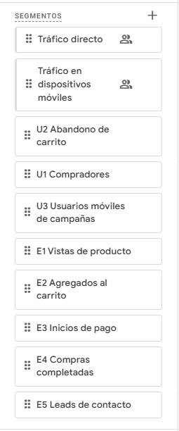

---

## 5. Audiencias (3)

Se crean en **Administrar > Audiencias > Nueva audiencia**. A diferencia de los segmentos, son permanentes y se pueden usar en campañas de Google Ads.

| # | Audiencia | Tipo | Condición | Duración | Uso |
| :-: | :--- | :--- | :--- | :-: | :--- |
| 1 | **Compradores** | Predefinida (*Compradores*) | Usuarios que han comprado | 30 días | Fidelización y recompra |
| 2 | **Carrito abandonado** | **Personalizada** | `add_to_cart`, **excluir temporalmente** a quienes hicieron `purchase` | 7 días | Remarketing con el cupón `QUETZAL10` |
| 3 | **Leads de contacto** | **Personalizada** | Evento `generate_lead` | 30 días | Seguimiento comercial a pedidos mayoristas |

> **Nota:** una audiencia empieza a llenarse desde su creación (no es retroactiva). Se debe crear **antes** de generar las interacciones. GA4 puede tardar 24 a 48 horas en mostrar los usuarios.

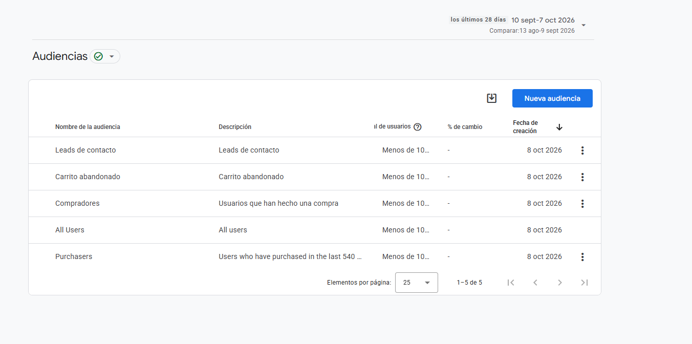
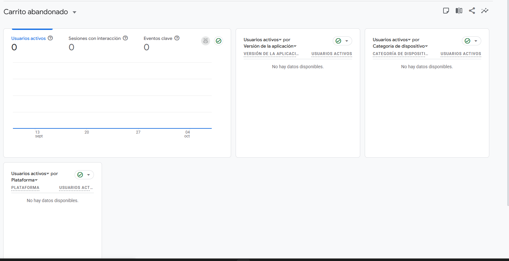

---

## 6. Generación de interacciones

Para que los informes tengan datos con variedad se escribió `02_generar_interacciones.py`. Usa **Playwright** y simula visitantes reales: cada sesión usa un navegador limpio (un usuario nuevo en GA4).

| Variable | Valores |
| :--- | :--- |
| Fuente de tráfico (UTM) | `google/organic`, directo, `facebook/social`, `instagram/social`, `newsletter/email`, `google/cpc` |
| Dispositivo | Escritorio (1366×768) y móvil (iPhone 13) |
| Comportamiento | Solo navegar (40 %), abandonar carrito (28 %), comprar (22 %), enviar formulario de contacto (10 %) |
| Acciones | Búsquedas, scroll, vistas de producto, carrito, checkout, pago demo |

```bash
pip install playwright
playwright install chromium
python 02_generar_interacciones.py --sesiones 60            # carga completa
python 02_generar_interacciones.py --sesiones 3 --visible   # prueba viendo el navegador
```

Además, se hicieron **compras manuales** desde la web para asegurar eventos `purchase` con valores reales.

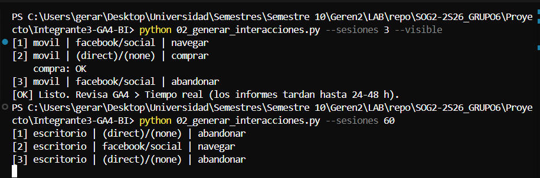

---

## 7. Exploraciones (2)

Ambas exploraciones se construyen **con los segmentos** de la sección 4.

### 7.1 Exploración de embudo: proceso de compra y abandono

**Explorar > Exploración de embudo.** Pasos (en orden):

1. `session_start`
2. `view_item`
3. `add_to_cart`
4. `begin_checkout`
5. `purchase`

Configuración: embudo **abierto**; desglose por **Categoría de dispositivo**; segmentos aplicados: **U1 Compradores**, **U2 Abandono de carrito** y **U3 Usuarios móviles de campañas**.

Esta exploración muestra en qué paso se abandona el carrito.

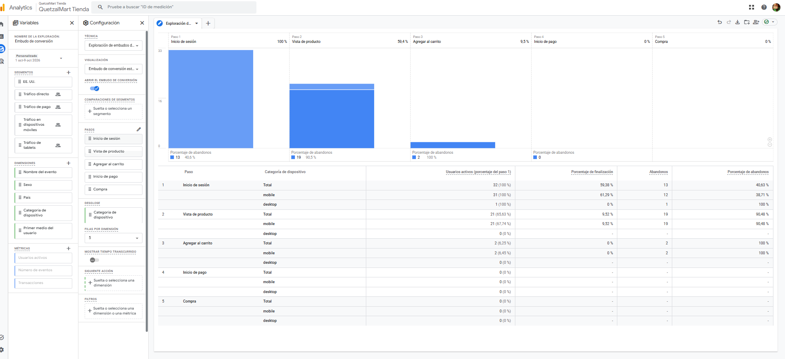

### 7.2 Exploración de formato libre: productos, canales y segmentos de eventos

**Explorar > Formato libre.**

- **Segmentos:** E1 Vistas de producto, E2 Agregados al carrito, E3 Inicios de pago, E4 Compras completadas, E5 Leads de contacto.
- **Dimensiones:** Nombre del artículo, Medio/fuente de la sesión, Categoría de dispositivo.
- **Métricas:** Artículos vistos, Artículos agregados al carrito, Artículos comprados, Ingresos por artículos, Recuento de eventos.
- **Filas:** Nombre del artículo; **Columnas:** Segmentos; **Visualización:** tabla y gráfica de barras.

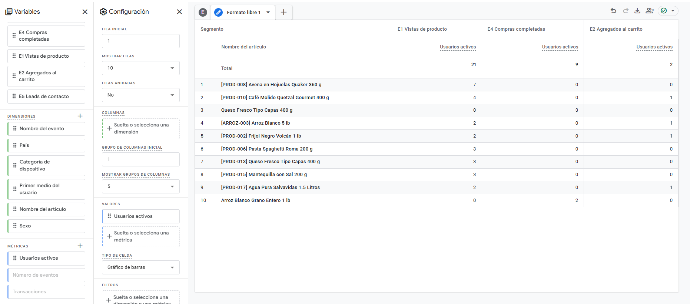

---

## 8. Informe de Inteligencia de Negocio

> Periodo analizado: **[COMPLETAR: fechas]**. Fuente: GA4, propiedad *QuetzalMart Tienda*.

### 8.1 Indicadores exigidos

| Indicador | Dónde verlo en GA4 | Valor |
| :--- | :--- | :--- |
| **Tasa de conversión** (sesiones con compra / sesiones) | Informes > Adquisición > Adquisición de tráfico (*Tasa de conversión de la sesión con evento clave*) | [COMPLETAR] % |
| **Adquisición de usuarios** | Informes > Adquisición > Adquisición de usuarios | [COMPLETAR] |
| **Total ingresos** | Informes > Monetización > Resumen de monetización | Q [COMPLETAR] |
| **Productos más vendidos** | Informes > Monetización > Compras de comercio electrónico | [COMPLETAR] |
| **Abandono de carrito** | Exploración de embudo (sección 7.1) | [COMPLETAR] % |

Fórmula del abandono de carrito: `1 − (compras ÷ usuarios que agregaron al carrito)`.

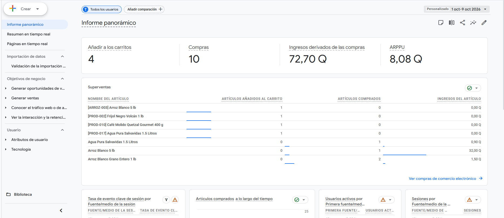

### 8.2 Adquisición y efectividad de campañas

*Captura: **Informes > Adquisición > Adquisición de tráfico**, con la gráfica por canal (incluye el canal Email de la campaña con UTM).*


| Canal | Sesiones | Compras | Conversión | Ingresos |
| :--- | :-: | :-: | :-: | :-: |
| [COMPLETAR] | | | | |

**Análisis:** [COMPLETAR: canal con más sesiones, canal con mejor conversión y rendimiento de la campaña de email.]

**Decisión de negocio:** [COMPLETAR: p. ej. redistribuir el presupuesto hacia el canal con mejor conversión.]

### 8.3 Comportamiento y puntos de fricción

*Capturas: **Participación > Páginas y pantallas** y **Participación > Eventos**.*

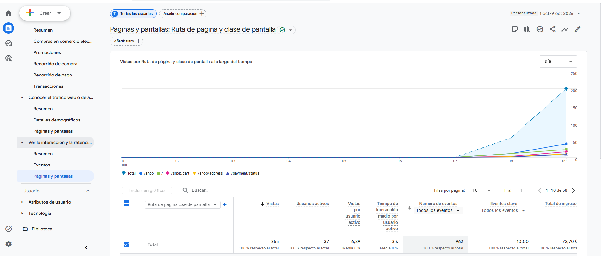
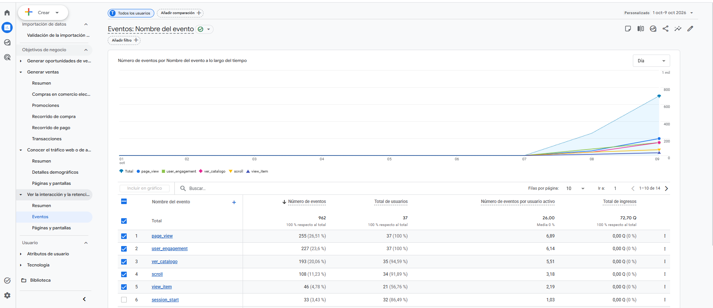

**Rebote:** en GA4 la tasa de rebote es `1 − tasa de interacción` (sesiones sin interacción). Se agrega como métrica en **Páginas y pantallas** (o en una exploración) para ver las páginas de mayor rebote.

| Página | Vistas | Tasa de rebote |
| :--- | :-: | :-: |
| [COMPLETAR] | | |

**Análisis:** [COMPLETAR: páginas con mayor rebote, volumen de `view_item` frente a `add_to_cart`.]

### 8.4 Dispositivos

*Captura: **Datos demográficos y tecnología > Detalles de tecnología** (categoría de dispositivo).*

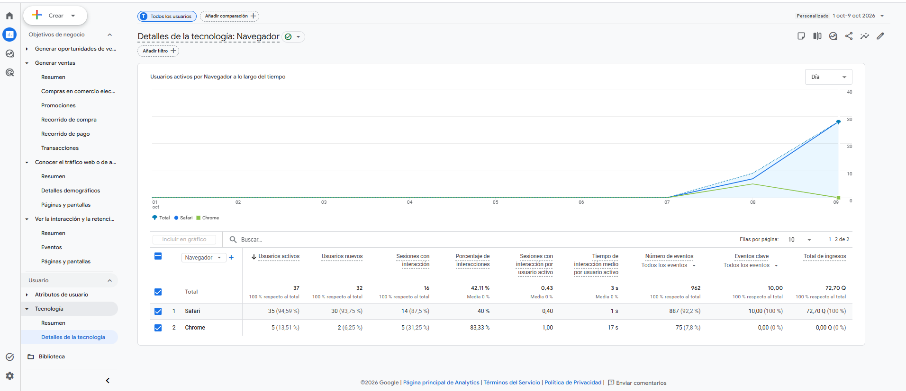

**Análisis:** [COMPLETAR: porcentaje móvil frente a escritorio y cuál convierte más.]

### 8.5 Monetización: productos más vendidos

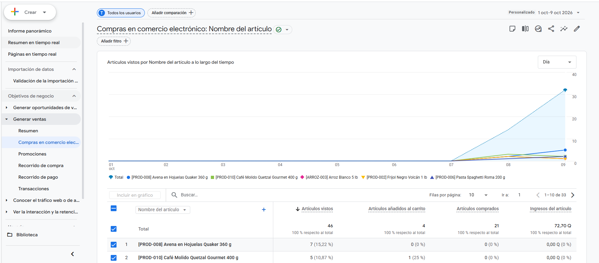

| Producto | Vistas | Agregados al carrito | Comprados | Ingresos |
| :--- | :-: | :-: | :-: | :-: |
| [COMPLETAR top 5] | | | | |

**Análisis:** [COMPLETAR: productos muy vistos que se compran poco = oportunidad de ajustar precio o ficha del producto.]

### 8.6 Hallazgos de las exploraciones

**Embudo de compra.**

| Paso | Usuarios | % que continúa |
| :--- | :-: | :-: |
| Inicio de sesión | [COMPLETAR] | 100 % |
| Vista de producto | [COMPLETAR] | [COMPLETAR] |
| Agregar al carrito | [COMPLETAR] | [COMPLETAR] |
| Inicio de pago | [COMPLETAR] | [COMPLETAR] |
| Compra | [COMPLETAR] | [COMPLETAR] |

**Hallazgo:** [COMPLETAR: paso con mayor abandono y su posible causa, p. ej. costo de envío o formulario de dirección largo.]

**Formato libre.** [COMPLETAR: comparación entre los segmentos de eventos E1 a E5.]

### 8.7 Segmentos y audiencias

| Segmento / Audiencia | Usuarios | Observación |
| :--- | :-: | :--- |
| U1 Compradores | [COMPLETAR] | [COMPLETAR] |
| U2 Abandono de carrito | [COMPLETAR] | [COMPLETAR] |
| U3 Usuarios móviles de campañas | [COMPLETAR] | [COMPLETAR] |
| Audiencia Carrito abandonado | [COMPLETAR] | Lista para remarketing |

### 8.8 Conclusiones y recomendaciones

1. [COMPLETAR: canal a reforzar.]
2. [COMPLETAR: mejora al proceso de pago según el embudo.]
3. [COMPLETAR: remarketing al carrito abandonado con el cupón `QUETZAL10`.]
4. [COMPLETAR: optimización para móvil o escritorio.]

---

## 9. Procedimiento de reproducción

1. Crear la propiedad y el flujo de datos de GA4 (sección 2.1).
2. `python 01_conectar_ga4.py --id G-W3XFZJZFCZ --sin-banner-cookies` (con el `.env` de `Integrante2-Tienda-CRM-Marketing`).
3. Volver a ejecutar `python 03_configurar_correo.py` (Integrante 2) para que la campaña lleve los UTM.
4. Crear eventos, eventos clave y **audiencias** (secciones 3 y 5).
5. `python 02_generar_interacciones.py --sesiones 60`, más algunas compras manuales.
6. Esperar de 24 a 48 horas; crear segmentos y exploraciones (secciones 4 y 7).
7. Tomar las capturas y completar la sección 8.

---

## 10. Guía para la calificación en vivo

En la calificación el auxiliar se registra, compra y recibe los correos; se debe mostrar **lo que él generó**. Tener listo antes:

- [ ] GA4 conectado y verificado (sección 2.3), sin banner de cookies.
- [ ] Pestañas abiertas: **Tiempo real**, **DebugView** y **Monetización > Compras de comercio electrónico**.
- [ ] Datos históricos ya cargados (interacciones de la sección 6, con al menos 24 a 48 h).
- [ ] Segmentos, audiencias y las 2 exploraciones guardados.

Durante la calificación:

1. Mientras el auxiliar navega, mostrar en **Tiempo real** su usuario y los eventos `view_item`, `add_to_cart`, `begin_checkout`, `purchase`.
2. Mostrar en **DebugView** el detalle de cada evento y los ingresos de la compra.
3. Al llegar el correo de marketing, hacer clic en su botón: el enlace con UTM debe aparecer en Tiempo real con fuente `quetzalmart / email`.
4. Mostrar después los informes históricos y las exploraciones.

> Los informes estándar de GA4 pueden tardar horas en incluir la compra del auxiliar. Tiempo real y DebugView la muestran de inmediato, por eso se usan primero.
