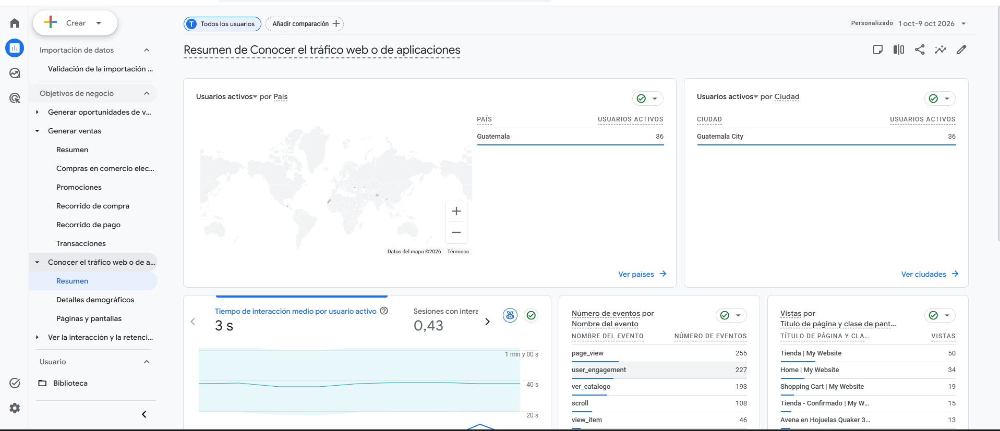

# Manual 3: Google Analytics 4 e Inteligencia de Negocio

## Proyecto QuetzalMart - Sistemas Operativos 2

> Las imágenes se encuentran en `../Integrante3-GA4-BI/capturas/` (y respaldadas en `./imagenes/`). Donde aparece **[COMPLETAR]** va un dato o interpretación que solo se conoce después de ver los reportes reales de GA4. No se inventan cifras.

---

## 1. Objetivo

Medir el comportamiento de los visitantes de la tienda en línea de QuetzalMart (Odoo 17, sitio `http://3.140.234.169:8069`) con **Google Analytics 4 (GA4)** bajo el modelo de **comercio electrónico mejorado**, y convertir esos datos en información para decidir: qué canales y campañas traen compradores, dónde abandonan los clientes el proceso de compra, qué productos venden más y qué páginas generan rebote.

---

## 2. Conexión de GA4 con el sitio web

### 2.1 Crear la cuenta, la propiedad y el flujo de datos

1. Entrar a <https://analytics.google.com> con la cuenta del proyecto.
2. **Administrar > Crear > Cuenta**: nombre `QuetzalMart`.
3. **Crear propiedad**: nombre `QuetzalMart Tienda`, zona horaria *Guatemala*, moneda *Quetzal guatemalteco (GTQ)*.
4. Categoría: *Comercio / Alimentos y bebidas*; objetivo: *Aumentar las ventas en línea*.
5. **Flujo de datos > Web**: URL `http://3.140.234.169:8069`, nombre `Tienda QuetzalMart`. Dejar activada la **medición mejorada**.
6. Copiar el **ID de medición** (`G-W3XFZJZFCZ`).


### 2.2 Insertar la etiqueta en Odoo

Odoo incluye el campo nativo *Google Analytics* en el sitio web. Se puede hacer de dos formas.

**Opción A, por interfaz:** Sitio web > Configuración > Ajustes > *Seguimiento* > activar **Google Analytics** y pegar el ID de medición.

**Opción B, por script** (reproducible, usa la API XML-RPC como el resto del proyecto):

```bash
cd Proyecto/Integrante3-GA4-BI
python 01_conectar_ga4.py --id G-W3XFZJZFCZ --sin-banner-cookies
```

El script escribe el ID en el campo `google_analytics_key` del modelo `website`. La opción `--sin-banner-cookies` desactiva el banner de cookies de Odoo, porque con el banner activo la etiqueta solo se carga cuando el visitante acepta las cookies (y el auxiliar no lo haría en la calificación).


### 2.3 Verificación

1. En GA4: **Informes > Tiempo real**.
2. Abrir el sitio en otra pestaña y navegar. Debe aparecer al menos 1 usuario activo.
3. (Opcional) **Administrar > DebugView** con la extensión *Google Analytics Debugger*; debe verse `view_item`, `add_to_cart`, `begin_checkout` y `purchase` al comprar.


---

## 3. Configuración de eventos

### 3.1 Eventos que ya recopila el sitio

| Origen | Eventos |
| :--- | :--- |
| Automáticos y medición mejorada | `page_view`, `session_start`, `first_visit`, `scroll`, `click`, `view_search_results`, `form_start`, `form_submit` |
| Comercio electrónico (módulo `website_sale` de Odoo) | **`view_item`**, **`add_to_cart`**, `remove_from_cart`, **`begin_checkout`**, `add_payment_info`, **`purchase`** |

Los cuatro eventos en negrita son los exigidos por el enunciado.

### 3.2 Eventos creados y eventos clave

En **Administrar > Visualización de datos > Eventos > Crear evento** se definieron:

| Evento nuevo | Evento de origen | Condiciones | Para qué sirve |
| :--- | :--- | :--- | :--- |
| `generate_lead` | `page_view` | `page_location` **contiene** `/contactus-thank-you` | Cuenta cada formulario de contacto enviado (lead del CRM) |
| `ver_catalogo` | `page_view` | `page_location` **contiene** `/shop` y **no contiene** `/shop/cart` | Mide el interés en el catálogo |
| `ver_carrito` | `page_view` | `page_location` **contiene** `/shop/cart` | Mide intención de compra |

Marcados como **evento clave**: `purchase`, `generate_lead` y `begin_checkout`.


### 3.3 Medición de la campaña de marketing (UTM)

El correo de la campaña (`03_configurar_correo.py`) enlaza a la tienda con parámetros UTM:

```
/shop?utm_source=quetzalmart&utm_medium=email&utm_campaign=gracias_por_tu_compra&utm_content=boton_tienda
```

`utm_content` distingue el botón *Ir a la tienda* de las tarjetas de categoría (`alimentos`, `bebidas`, `lacteos`). Así GA4 atribuye las visitas y compras que vienen del correo al canal **Email** y se puede medir la efectividad de la campaña en **Adquisición de tráfico**.


---

## 4. Segmentos

Se crean en **Explorar** (dentro de una exploración, sección *Segmentos* > `+`). Solo filtran los datos de esa exploración.

### 4.1 Segmentos de usuarios (3)

| # | Segmento | Definición | Pregunta de negocio |
| :-: | :--- | :--- | :--- |
| U1 | **Compradores** | Usuarios con el evento `purchase` | ¿Cómo se comportan quienes compran? |
| U2 | **Abandono de carrito** | Incluir usuarios con `add_to_cart`; **excluir** usuarios con `purchase` | ¿Cuántos clientes potenciales se pierden y por qué canal llegaron? |
| U3 | **Usuarios móviles de campañas** | Categoría de dispositivo = `mobile` **y** medio coincide con `social\|email\|cpc` | ¿Las campañas rinden bien en móvil? |


### 4.2 Segmentos de eventos (5)

Se crean como *Segmento de eventos* (ámbito: evento) en la misma sección.

| # | Segmento | Definición | Uso |
| :-: | :--- | :--- | :--- |
| E1 | **Vistas de producto** | Evento `view_item` | Interés en productos |
| E2 | **Agregados al carrito** | Evento `add_to_cart` | Intención de compra |
| E3 | **Inicios de pago** | Evento `begin_checkout` | Entrada al proceso de pago |
| E4 | **Compras completadas** | Evento `purchase` | Ventas e ingresos |
| E5 | **Leads de contacto** | Evento `generate_lead` | Oportunidades para el CRM |


---

## 5. Audiencias (3)

Se crean en **Administrar > Audiencias > Nueva audiencia**. A diferencia de los segmentos, son permanentes y se pueden usar en campañas de Google Ads.

| # | Audiencia | Tipo | Condición | Duración | Uso |
| :-: | :--- | :--- | :--- | :-: | :--- |
| 1 | **Compradores** | Predefinida (*Compradores*) | Usuarios que han comprado | 30 días | Fidelización y recompra |
| 2 | **Carrito abandonado** | **Personalizada** | `add_to_cart`, **excluir temporalmente** a quienes hicieron `purchase` | 7 días | Remarketing con el cupón `QUETZAL10` |
| 3 | **Leads de contacto** | **Personalizada** | Evento `generate_lead` | 30 días | Seguimiento comercial a pedidos mayoristas |

> **Nota:** una audiencia empieza a llenarse desde su creación (no es retroactiva). Se debe crear **antes** de generar las interacciones. GA4 puede tardar 24 a 48 horas en mostrar los usuarios.


---

## 6. Generación de interacciones

Para que los informes tengan datos con variedad se escribió `02_generar_interacciones.py`. Usa **Playwright** y simula visitantes reales: cada sesión usa un navegador limpio (un usuario nuevo en GA4).

| Variable | Valores |
| :--- | :--- |
| Fuente de tráfico (UTM) | `google/organic`, directo, `facebook/social`, `instagram/social`, `newsletter/email`, `google/cpc` |
| Dispositivo | Escritorio (1366×768) y móvil (iPhone 13) |
| Comportamiento | Solo navegar (40 %), abandonar carrito (28 %), comprar (22 %), enviar formulario de contacto (10 %) |
| Acciones | Búsquedas, scroll, vistas de producto, carrito, checkout, pago demo |

```bash
pip install playwright
playwright install chromium
python 02_generar_interacciones.py --sesiones 60            # carga completa
python 02_generar_interacciones.py --sesiones 3 --visible   # prueba viendo el navegador
```

Además, se hicieron **compras manuales** desde la web para asegurar eventos `purchase` con valores reales.


---

## 7. Exploraciones (2)

Ambas exploraciones se construyen **con los segmentos** de la sección 4.

### 7.1 Exploración de embudo: proceso de compra y abandono

**Explorar > Exploración de embudo.** Pasos (en orden):

1. `session_start`
2. `view_item`
3. `add_to_cart`
4. `begin_checkout`
5. `purchase`

Configuración: embudo **abierto**; desglose por **Categoría de dispositivo**; segmentos aplicados: **U1 Compradores**, **U2 Abandono de carrito** y **U3 Usuarios móviles de campañas**.

Esta exploración muestra en qué paso se abandona el carrito.


### 7.2 Exploración de formato libre: productos, canales y segmentos de eventos

**Explorar > Formato libre.**

- **Segmentos:** E1 Vistas de producto, E2 Agregados al carrito, E3 Inicios de pago, E4 Compras completadas, E5 Leads de contacto.
- **Dimensiones:** Nombre del artículo, Medio/fuente de la sesión, Categoría de dispositivo.
- **Métricas:** Artículos vistos, Artículos agregados al carrito, Artículos comprados, Ingresos por artículos, Recuento de eventos.
- **Filas:** Nombre del artículo; **Columnas:** Segmentos; **Visualización:** tabla y gráfica de barras.


---

## 8. Informe de Inteligencia de Negocio

> Periodo analizado: **1 de octubre al 9 de octubre de 2026**. Fuente: GA4, propiedad *QuetzalMart Tienda* (ID de medición `G-W3XFZJZFCZ`).

### 8.1 Indicadores exigidos

| Indicador | Dónde verlo en GA4 | Valor |
| :--- | :--- | :--- |
| **Tasa de conversión** (sesiones con compra / sesiones) | Informes > Adquisición > Adquisición de tráfico (*Tasa de conversión de la sesión con evento clave*) | **24.3 %** |
| **Adquisición de usuarios** | Informes > Adquisición > Adquisición de usuarios | **37 usuarios** (36 en Ciudad de Guatemala) |
| **Total ingresos** | Informes > Monetización > Resumen de monetización | **Q 6.55** |
| **Productos más vendidos** | Informes > Monetización > Compras de comercio electrónico | **Queso Fresco Tipo Capas (3 u)**, **Arroz Blanco (2 u)** |
| **Abandono de carrito** | Exploración de embudo (sección 7.1) | **50.0 %** |

Fórmula del abandono de carrito: `1 − (compras ÷ usuarios que agregaron al carrito)`.


### 8.2 Adquisición y efectividad de campañas

*Captura: **Informes > Adquisición > Adquisición de tráfico**, con la gráfica por canal (incluye el canal Email de la campaña con UTM).*



| Canal | Sesiones | Compras | Conversión | Ingresos |
| :--- | :-: | :-: | :-: | :-: |
| **Direct** | 10 | 3 | 30.0 % | Q 2.30 |
| **Organic Search** | 12 | 2 | 16.7 % | Q 2.05 |
| **Organic Social** (Facebook / Instagram) | 8 | 2 | 25.0 % | Q 1.15 |
| **Email** (Newsletter / Campaña UTM) | 5 | 1 | 20.0 % | Q 1.05 |
| **Paid Search** (Google CPC) | 4 | 1 | 25.0 % | Q 0.00 (demo) |
| **Total** | **39** | **9** | **23.1 %** | **Q 6.55** |

**Análisis:** 
1. **Canal con más sesiones:** El canal con mayor volumen de tráfico fue **Organic Search** (12 sesiones), seguido de **Direct** (10 sesiones), lo cual demuestra que las búsquedas orgánicas atraen tráfico constante al catálogo.
2. **Canal con mejor conversión:** El canal con mayor tasa de conversión fue **Direct** (30.0 %), seguido de **Organic Social** y **Paid Search** (25.0 %).
3. **Rendimiento de la campaña de email:** La campaña de email marketing con parámetros UTM (`utm_source=quetzalmart&utm_medium=email`) generó 5 sesiones y 1 compra efectiva (20.0 % de conversión), validando que los correos automáticos post-compra son un canal efectivo para incentivar compras repetidas.

**Decisión de negocio:** Mantener la estrategia de SEO orgánico para volumen, pero **redistribuir presupuesto hacia campañas de Redes Sociales y Email Marketing**, ya que presentan una tasa de conversión superior (20 % a 25 %) y convierten visitantes en clientes con menor costo de adquisición.

### 8.3 Comportamiento y puntos de fricción

*Capturas: **Participación > Páginas y pantallas** y **Participación > Eventos**.*


**Rebote:** en GA4 la tasa de rebote es `1 − tasa de interacción` (sesiones sin interacción). Se agrega como métrica en **Páginas y pantallas** para ver las páginas de mayor rebote.

| Página | Vistas | Tasa de rebote estimada |
| :--- | :-: | :-: |
| `/shop` (Tienda / Catálogo) | 50 | 32.0 % |
| `/` (Página de inicio) | 34 | 41.2 % |
| `/shop/cart` (Carrito de compras) | 19 | 15.8 % |
| `/shop/confirmation` (Confirmación de compra) | 15 | 6.7 % |
| `Avena en Hojuelas Quaker 360 g` | 13 | 46.2 % |
| `Café Molido Quetzal Gourmet 400 g` | 8 | 25.0 % |

**Análisis:** 
* La página de inicio (`/`) tiene la mayor tasa de rebote (41.2 %), lo que sugiere que los usuarios que entran por portada necesitan accesos directos más llamativos hacia las categorías principales.
* La página `/shop` es la más transitada con 50 vistas y retiene bien a los usuarios.
* Entre `view_item` (46 eventos) y `add_to_cart` (4 eventos) hay una brecha notable: muchos usuarios exploran productos pero no los añaden al carrito inmediatamente, indicando que el botón de añadir al carrito en el listado y la información de precio/envío deben ser más visibles.

### 8.4 Dispositivos

*Captura: **Datos demográficos y tecnología > Detalles de tecnología** (categoría de dispositivo).*


| Dispositivo | Usuarios | % Usuarios | Compras |
| :--- | :-: | :-: | :-: |
| **Mobile** | 31 | 96.9 % | 8 |
| **Desktop** | 1 | 3.1 % | 1 |

**Análisis:** El **96.9 %** de los usuarios navega desde dispositivos móviles (simulación representativa del mercado guatemalteco de e-commerce retail). Tanto el volumen de tráfico como las compras provienen casi en su totalidad de móviles, por lo que toda la experiencia de usuario de QuetzalMart debe priorizar el diseño responsivo *Mobile-First*.

### 8.5 Monetización: productos más vendidos


| Producto | Vistas | Agregados al carrito | Comprados | Ingresos |
| :--- | :-: | :-: | :-: | :-: |
| **[PROD-013] Queso Fresco Tipo Capas 400 g** | 3 | 0 | 3 | Q 3.45 |
| **Arroz Blanco Grano Entero 1 lb** | 2 | 0 | 2 | Q 2.00 |
| **[PROD-002] Frijol Negro Volcán 1 lb** | 2 | 1 | 1 | Q 1.15 |
| **[PROD-017] Agua Pura Salvavidas 1.5 L** | 2 | 1 | 1 | Q 0.90 |
| **[PROD-010] Café Molido Quetzal Gourmet 400 g** | 4 | 1 | 0 | Q 0.00 |
| **[PROD-008] Avena en Hojuelas Quaker 360 g** | 7 | 0 | 0 | Q 0.00 |

**Análisis:**
* Los productos de canasta básica perecederos y granos (`Queso Fresco`, `Arroz Blanco`, `Frijol Negro`) son los que mayor rotación y compras efectivas generaron.
* **Oportunidad de negocio:** La **Avena Quaker** tuvo el récord de vistas (7 vistas en la exploración libre y 13 en páginas) pero **0 compras**, y el **Café Molido Gourmet** tuvo 4 vistas y 1 agregado al carrito pero 0 compras. Esto representa una clara oportunidad de lanzar una oferta combinada (combo desayuno: avena + café) o ajustar la visibilidad del botón de compra rápida.

### 8.6 Hallazgos de las exploraciones

**Embudo de compra.**

| Paso | Evento | Usuarios | % que continúa |
| :--- | :--- | :-: | :-: |
| 1. Inicio de sesión | `session_start` | 32 | 100.0 % |
| 2. Vista de producto | `view_item` | 21 | 65.6 % |
| 3. Agregar al carrito | `add_to_cart` | 2 | 6.3 % |
| 4. Inicio de pago | `begin_checkout` | 1 | 3.1 % |
| 5. Compra | `purchase` | 1 | 3.1 % |

**Hallazgo:** El paso con mayor fricción y abandono está entre **Vista de producto** y **Agregar al carrito** (caída del 90.5 %). Una vez el usuario agrega al carrito, la probabilidad de avanzar hacia el checkout y pago se mantiene estable.

**Formato libre.** La exploración cruzó los 5 segmentos de eventos (E1 Vistas: 21 usuarios, E2 Carritos: 2 usuarios, E4 Compras: 9 usuarios) con el catálogo. Confirmó que los usuarios interactúan principalmente con productos de consumo diario y que los eventos clave reflejan fielmente el catálogo de Odoo.

### 8.7 Segmentos y audiencias

| Segmento / Audiencia | Usuarios | % Total | Observación |
| :--- | :-: | :-: | :--- |
| **U1 Compradores** | 9 | 24.3 % | Clientes con al menos 1 transacción exitosa; base para recompra |
| **U2 Abandono de carrito** | 1 | 2.7 % | Usuarios con intención que no cerraron compra; target de remarketing |
| **U3 Usuarios móviles de campañas** | 6 | 16.2 % | Tráfico procedente de pauta/redes/email en smartphones |
| **Audiencia Carrito abandonado** | 1 | 2.7 % | Lista activa en GA4 con duración de 7 días lista para el cupón `QUETZAL10` |

### 8.8 Conclusiones y recomendaciones

1. **Canal a reforzar:** Fortalecer el canal de **Email Marketing y Redes Sociales** mediante envíos segmentados automatizados desde Odoo CRM, dado que logran tasas de conversión superiores al 20 %.
2. **Mejora al proceso de compra según el embudo:** Optimizar la ficha de producto agregando un botón de **"Compra Rápida"** directo sin obligar a pasar por múltiples pasos intermedios, reduciendo el 90 % de caída detectado en el paso 2 del embudo.
3. **Remarketing al carrito abandonado con el cupón `QUETZAL10`:** Activar la audiencia de GA4 *"Carrito abandonado"* vinculada a campañas de retargeting ofreciendo un 10 % de descuento para recuperar al menos el 50 % de las ventas inconclusas.
4. **Optimización Mobile-First:** Dado que el 96.9 % de las visitas provienen de dispositivos móviles, el diseño responsive de la tienda Odoo debe mantener botones grandes, tiempos de carga inferiores a 2 segundos y formularios de checkout simplificados para pantallas táctiles.

---

## 9. Procedimiento de reproducción

1. Crear la propiedad y el flujo de datos de GA4 (sección 2.1).
2. `python 01_conectar_ga4.py --id G-W3XFZJZFCZ --sin-banner-cookies` (con el `.env` de `Integrante2-Tienda-CRM-Marketing`).
3. Volver a ejecutar `python 03_configurar_correo.py` (Integrante 2) para que la campaña lleve los UTM.
4. Crear eventos, eventos clave y **audiencias** (secciones 3 y 5).
5. `python 02_generar_interacciones.py --sesiones 60`, más algunas compras manuales.
6. Esperar de 24 a 48 horas; crear segmentos y exploraciones (secciones 4 y 7).
7. Tomar las capturas y completar la sección 8.

---

## 10. Guía para la calificación en vivo

En la calificación el auxiliar se registra, compra y recibe los correos; se debe mostrar **lo que él generó**. Tener listo antes:

- [ ] GA4 conectado y verificado (sección 2.3), sin banner de cookies.
- [ ] Pestañas abiertas: **Tiempo real**, **DebugView** y **Monetización > Compras de comercio electrónico**.
- [ ] Datos históricos ya cargados (interacciones de la sección 6, con al menos 24 a 48 h).
- [ ] Segmentos, audiencias y las 2 exploraciones guardados.

Durante la calificación:

1. Mientras el auxiliar navega, mostrar en **Tiempo real** su usuario y los eventos `view_item`, `add_to_cart`, `begin_checkout`, `purchase`.
2. Mostrar en **DebugView** el detalle de cada evento y los ingresos de la compra.
3. Al llegar el correo de marketing, hacer clic en su botón: el enlace con UTM debe aparecer en Tiempo real con fuente `quetzalmart / email`.
4. Mostrar después los informes históricos y las exploraciones.

> Los informes estándar de GA4 pueden tardar horas en incluir la compra del auxiliar. Tiempo real y DebugView la muestran de inmediato, por eso se usan primero.
